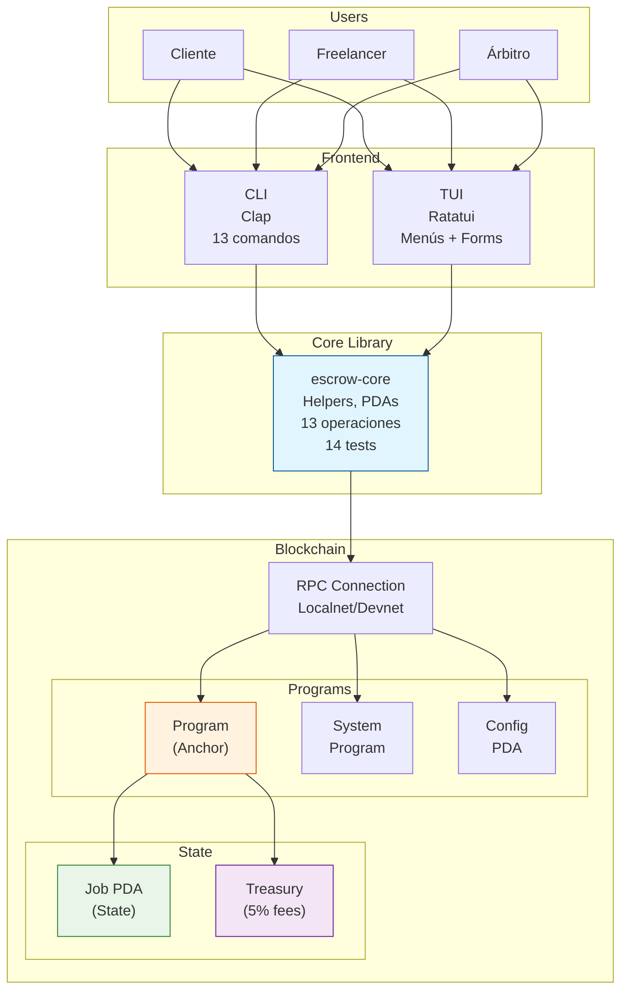
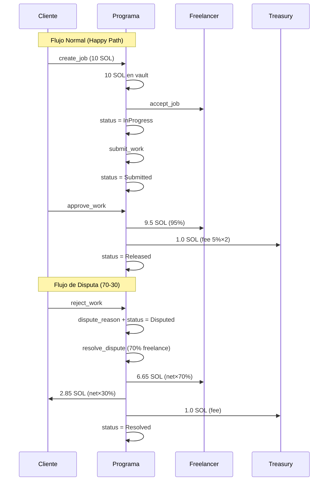
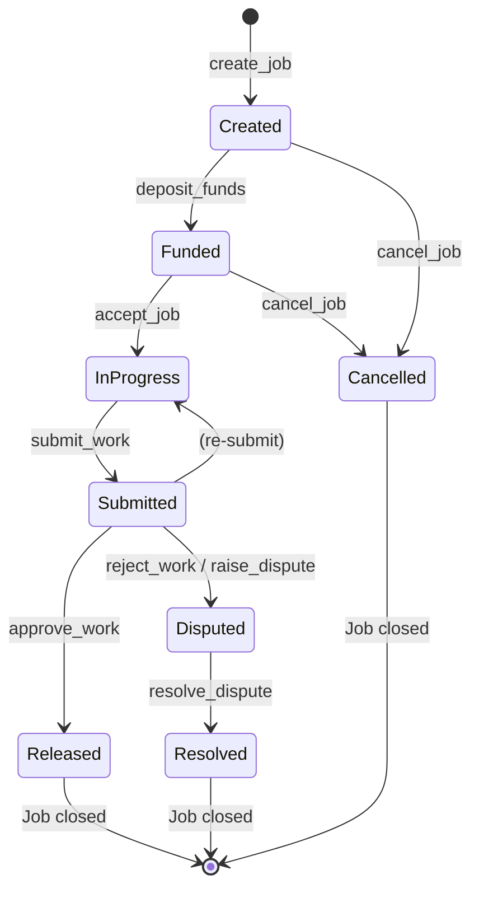

# Arquitectura - Trust Work Escrow

## 📐 Visión General



## 🏗️ Componentes

### 1. Smart Contract (Anchor)

#### Responsabilidades
- Gestionar el estado de los trabajos
- Manejar depósitos y retiros de fondos
- Validar reglas de negocio
- Emitir eventos

#### Cuentas
- **Config**: Configuración global (fee, treasury)
- **Job**: Cada trabajo/escrow

### 2. CLI (Rust + Clap)

#### Responsabilidades
- Interfaz de usuario por terminal
- Parsear comandos y argumentos
- Comunicarse con el programa via RPC (usa escrow-core)

#### Estructura
```bash
cli/
├── src/
│   └── main.rs          # Entry point + 13 subcomandos Clap
└── Cargo.toml           # Deps: escrow-core, clap, anyhow
```

### 3. TUI (Ratatui)

#### Responsabilidades
- Interfaz gráfica interactiva de terminal
- Gestión multi-wallet con roles
- Temas y configuración persistente
- Comunicarse con el programa via RPC (usa escrow-core)

#### Estructura
```bash
tui/
├── src/
│   ├── main.rs          # Entry point, setup terminal
│   ├── app.rs           # Estado, eventos, navegación, forms
│   ├── ui.rs            # Renderizado de pantallas
│   └── config.rs        # Temas, settings, persistencia
└── Cargo.toml           # Deps: escrow-core, ratatui, crossterm
```

### 4. escrow-core (Librería compartida)

#### Responsabilidades
- Centralizar lógica de interacción con el smart contract
- Derivación de PDAs
- Construcción y envío de transacciones
- Eliminación de duplicación entre CLI y TUI

#### Estructura
```bash
escrow-core/
├── src/
│   └── lib.rs           # Helpers + 13 operaciones + 14 tests
└── Cargo.toml           # Deps: anchor-client, solana-rpc-client, borsh
```

### 5. Wallet

#### Tipos soportados
- CLI keypair (archivo JSON)
- Hardware wallet (Ledger)
- Wallet browser (via RPC)

## 💰 Flujo de Fondos



---

## 🔄 Flujo de Estados



## 📦 Estructura de Datos

### Job Account

| Offset | Size | Field | Description |
|--------|------|-------|-------------|
| 0 | 8 | `discriminator` | Anchor account discriminator |
| 8 | 32 | `client` | Pubkey del cliente |
| 40 | 32 | `freelancer` | Pubkey del freelancer |
| 72 | 32 | `arbiter` | Pubkey del árbitro |
| 104 | 8 | `amount` | Monto total (lamports) |
| 112 | 8 | `fee` | Comisión del programa |
| 120 | 1 | `status` | Estado del trabajo |
| 121 | 4 | `title_len` | Longitud del título |
| 125 | 100 | `title` | Título (max 100 bytes) |
| 225 | 4 | `desc_len` | Longitud de descripción |
| 229 | 500 | `description` | Descripción (max 500 bytes) |
| 729 | 8 | `deadline` | Timestamp deadline |
| 737 | 8 | `created_at` | Timestamp creación |
| 745 | 8 | `updated_at` | Timestamp actualización |
| 753 | 4 | `dispute_len` | Longitud razón disputa |
| 757 | 200 | `dispute_reason` | Razón de disputa |
| 957 | 1 | `bump` | Bump para PDA |

**Total: ~958 bytes**

---

## 🔌 Integración

### Conexión RPC

```rust
// Configuración de conexión
let rpc_url = "https://api.devnet.solana.com";
let connection = Connection::new(rpc_url);
```

### Anchor Client

```rust
// Cargar programa
let program = anchor::Client::new(
    anchor::Provider::new(
        connection,
        wallet,
        anchor::CommitmentConfig::confirmed(),
    ),
    program_id,
);
```

## 📡 Eventos

### On-Chain Events

```
Transaction Log:
├─ Program consumed 12345 compute units
├─ Program data: [event data]
└─ Program returned success
```

### Off-Chain Events (via RPC)

```typescript
// Suscribirse a cambios de cuenta
program.account.job.subscribe(jobId, (job) => {
    console.log('Job updated:', job.status);
});
```

## 🔒 Modelo de Seguridad

### Capas de Seguridad

1. **Validación de Entrada**
   - Tipos de datos correctos
   - Rangos válidos
   - Longitudes máximas

2. **Verificación de Firmas**
   - Solo firmantes autorizados
   - Validación de ownership

3. **Restricciones de Estado**
   - Transiciones de estado válidas
   - Flags de autorización

4. **Gestión de Fondos**
   - Transfers atómicos
   - Cálculo correcto de fees

## 📊 Métricas

### Límites del Programa

| Recurso | Límite |
|---------|--------|
| Título | 100 bytes |
| Descripción | 500 bytes |
| Razón disputa | 200 bytes |
| Máximo fee | 10% |
| deadline | Timestamp futuro |

### Costos Estimados

| Operación | Compute Units |
|-----------|---------------|
| create_job | ~10,000 |
| accept_job | ~5,000 |
| submit_work | ~5,000 |
| approve_work | ~10,000 |
| dispute | ~5,000 |
| resolve | ~15,000 |

## 🚀 Roadmap Técnico

### ✅ Implementado (MVP v2 — Jul 2026)

- [x] Pool de árbitros con registro (create/add/remove arbiter)
- [x] Sistema de disputas con evidencia y resolución parcial
- [x] Milestones con pagos parciales por hito
- [x] Multi-wallet por usuario (hasta 5 wallets)
- [x] Equipos de freelancers (miembros + roles)
- [x] Treasury con fees configurables
- [x] Pausa de emergencia del programa
- [x] Deploy a devnet: `28QTH6qfG2iKDVXNY8nUTKDjx8yrBrQpnvXCPyJsrwuA`

### 🔜 Post-MVP (Q3-Q4 2026)

- [ ] Tokens SPL (USDC) — pagos en stablecoins
- [ ] Gasless transactions (relayers)
- [ ] Off-chain metadata (IPFS)
- [ ] Sistema de reputación on-chain
- [ ] Notificaciones (push/email)
- [ ] Wallet browser (integración con wallet adapters)
- [ ] Tests de integración exhaustivos
- [ ] Migración a Anchor v1

### 🔮 Visión Larga (2027)

- [ ] DAO governance para el treasury
- [ ] Seguro descentralizado para disputas
- [ ] Integración con oráculos (Pyth/Switchboard)
- [ ] Versión mobile (React Native)
