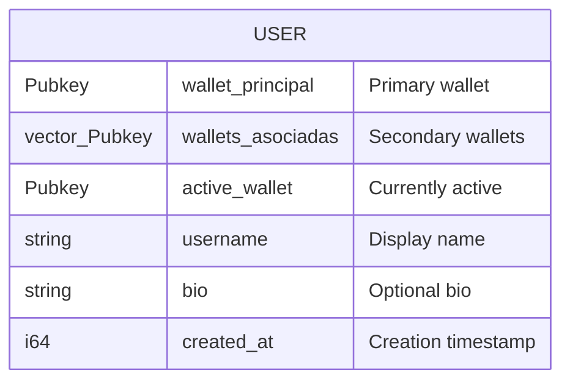
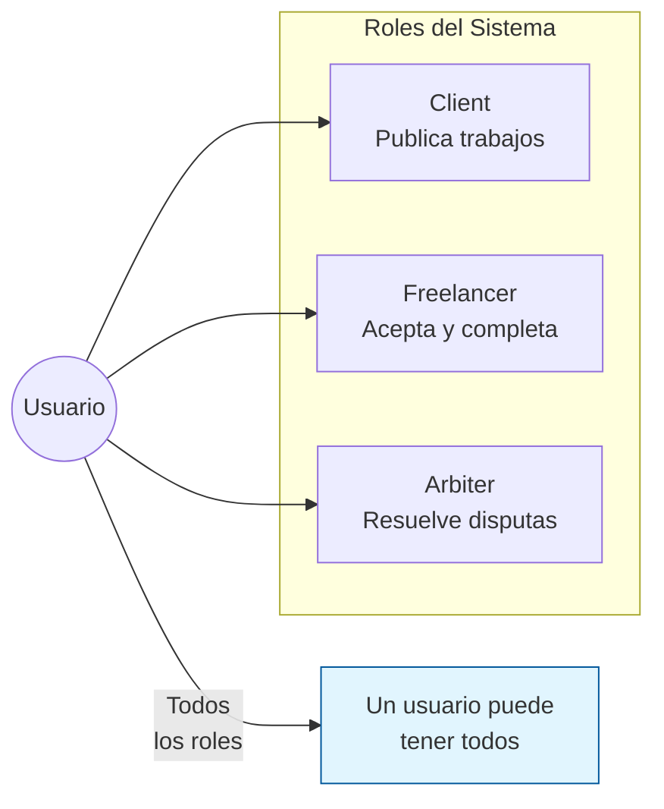
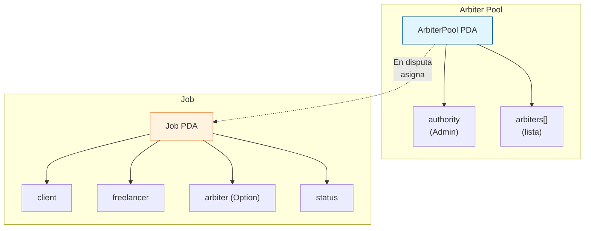
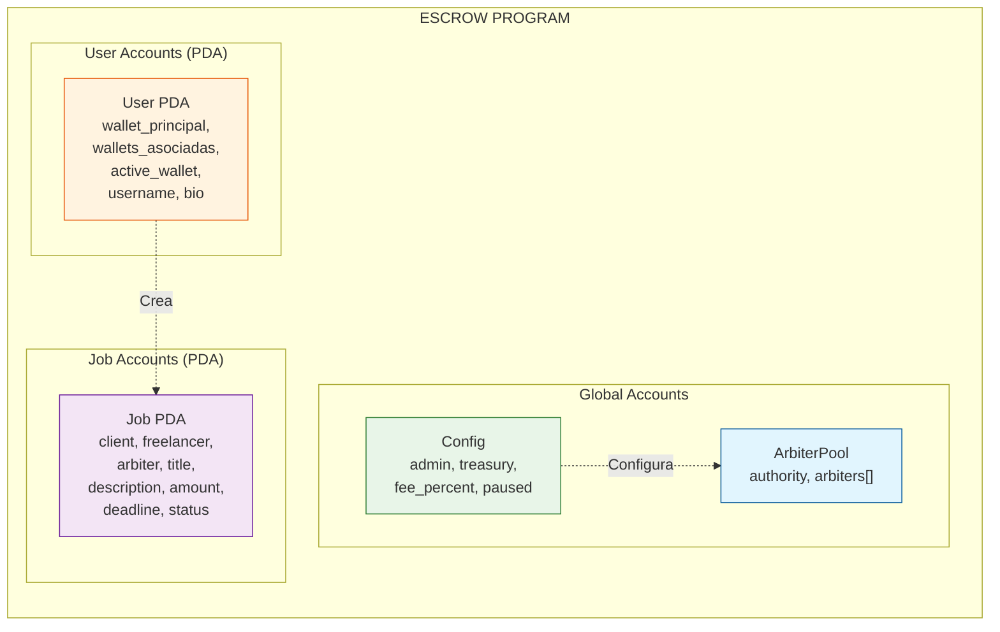

# Diseño del Smart Contract v2

## Resumen de Decisiones

### 1. Usuarios y Wallets

**Semántica**: Una cuenta de usuario puede tener múltiples wallets associadas (como multiboot). Solo una activa por sesión, pero puede cambiar.

---

### 2. Roles (Libertad total)

**Cómo se determina el rol**:
- Client → Es el `client` en algún Job PDA
- Freelancer → Es el `freelancer` en algún Job PDA
- Arbiter → Está registrado en el pool de árbitros

---

### 3. Árbitros

**Flujo**:
1. Al crear job → `arbiter` = None (en blanco)
2. Si hay disputa → Se asigna automáticamente un árbitro del pool
3. O el cliente puede elegir uno específico

---

### 4. Gobernanza (Admin + Tesorero)

| Rol | Tipo | Justificación |
|-----|------|---------------|
| **Admin** | Multisig 2-of-3 | Inicializar, pausar, upgrades |
| **Tesorero** | Multisig 2-of-3 | Retirar fees acumulados |

**Por qué NO single signer**:
- Seguridad: Si perdés una key, el proyecto muere
- Confianza: Para un DeFi, múltiples firmas es estándar

---

### 5. Estructura de Cuentas On-Chain

---

## Instrucciones del Programa

| Instruccion | Descripcion | Quien puede |
|-------------|-------------|-------------|
| `initialize_config` | Crear config global | Admin (multisig) |
| `create_user` | Crear perfil de usuario | Cualquiera |
| `add_wallet` | Agregar wallet secundaria | Usuario owner |
| `set_active_wallet` | Cambiar wallet activa | Usuario owner |
| `register_arbiters` | Agregar árbitros al pool | Admin |
| `create_job` | Publicar trabajo | Client |
| `accept_job` | Aceptar trabajo | Freelancer |
| `submit_work` | Entregar trabajo | Freelancer |
| `approve_work` | Aprobar trabajo | Client |
| `reject_work` | Rechazar trabajo | Client |
| `raise_dispute` | Iniciar disputa | Client o Freelancer |
| `resolve_dispute` | Resolver disputa | Arbiter |
| `cancel_job` | Cancelar trabajo | Client |
| `pause` | Pausar programa | Admin |
| `unpause` | Reanudar programa | Admin |
| `withdraw_treasury` | Retirar fees | Tesorero (multisig) |

---

## Notas Técnicas

- **Account discriminator**: 8 bytes para discriminación
- **Space calculation**: Usar `INIT_SPACE` de Anchor
- **PDA derivation**: Semillas = [b"seed", ...args]
- **CPI**: System Program para transferencias SOL

---

## Próximos Pasos

1. SDD → Especificación detallada
2. Implementar smart contract en Anchor
3. Tests de integración
4. Desplegar a devnet