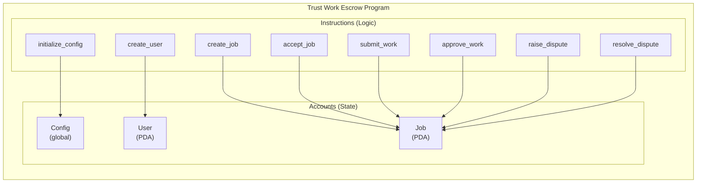
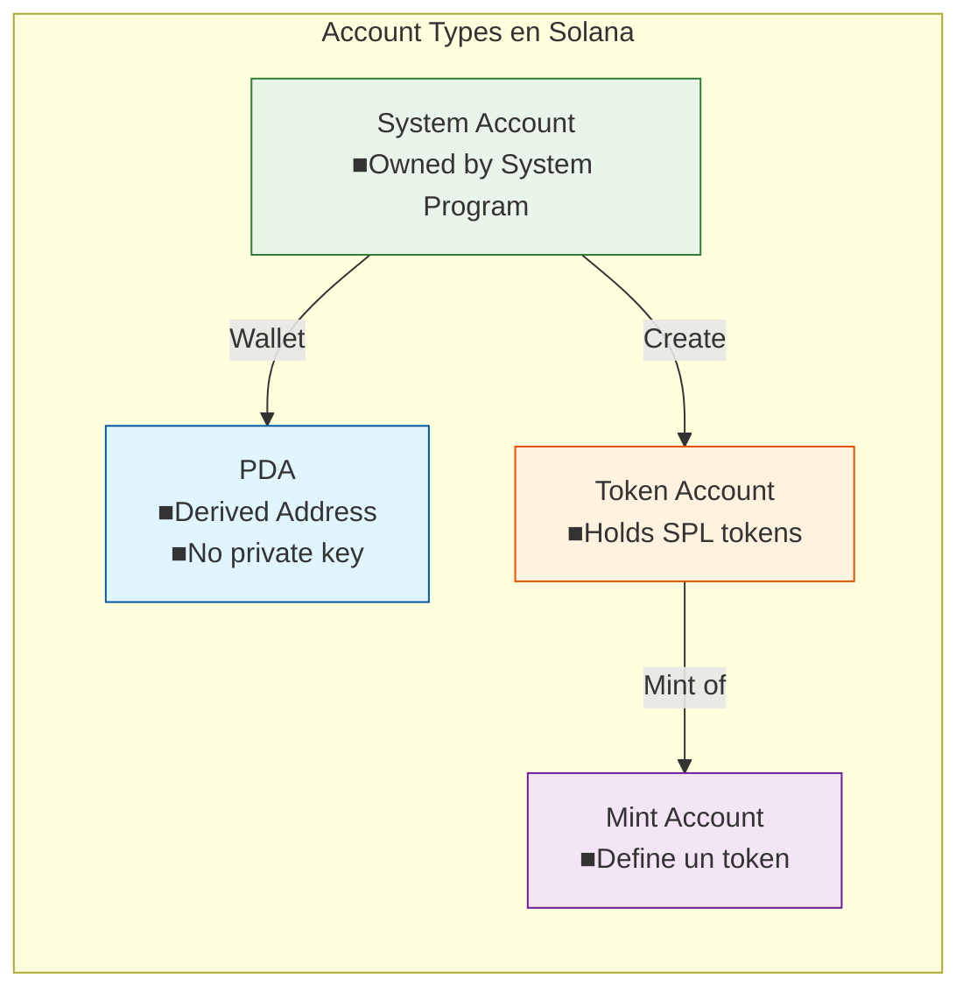
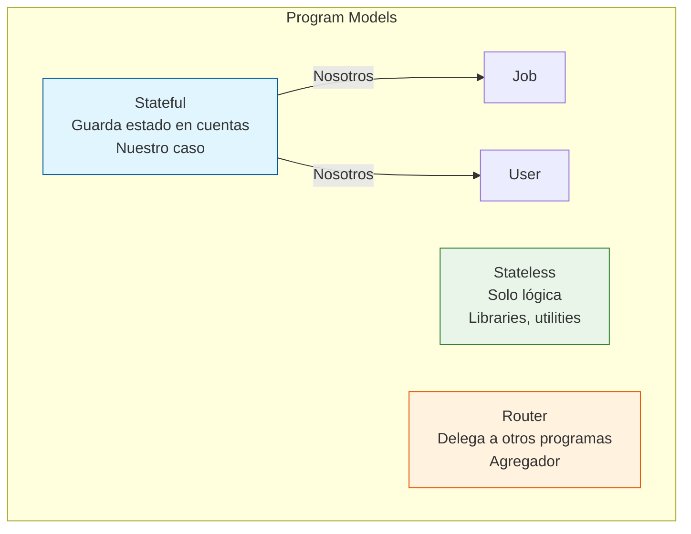

# Tipos de Contratos en Solana

## Overview

En Solana, los "contratos inteligentes" se llaman **Programs**. Cada program es un ejecutable en la blockchain que define lógica y estado.

## Tipos de Contratos/Programas

### 1. Native Programs (Sistema Nativo)

| Programa | Descripción |
|----------|-------------|
| **System Program** | Crear cuentas, transferir SOL, crear PDAs básicas |
| **Vote Program** | Gobernanza, votaciones de validators |
| **Stake Program** | Staking de SOL |
| **Sysvar Programs** | Clock, Rewards, Fees, etc. |

**Uso en nuestro proyecto**: ✅ System Program para transferencias SOL

---

### 2. Token Programs (SPL Tokens)

| Estándar | Descripción | Uso Actual |
|----------|-------------|------------|
| **SPL Token** | Tokens básico (fungible) | ⏳ Pendiente |
| **Token-2022** | Extensiones (transfer fees, confidential transfers) | ⏳ Pendiente |
| **Associated Token Account (ATA)** | Cuentas token linked a wallet | ⏳ Pendiente |

**Uso en nuestro proyecto**: 
- Fase 1: Solo SOL
- Fase 2: USDC via Token-2022

---

### 3. Anchor Programs (Nuestro caso)

---

### 4. Tipos de Gobernanza

| Tipo | Descripción | Pros | Contras |
|------|-------------|------|---------|
| **Single Signer** | 1 persona tiene el control | Simple | Punto único de fallo |
| **Multisig** | M de N firmas requeridas | Más seguro | Necesita coordinación |
| **DAO** | Tokens = votos, propuestas on-chain | Descentralizado | Complejo, gas |

**Recomendación para Admin/Tesorero**:
- **Admin**: Multisig (2 de 3) - para decisiones críticas
- **Tesorero**: Multisig (2 de 3) o DAO pequeño - para withdraw fees

**Por qué NO single signer**:
- Si perdés la key, se acabo el proyecto
- Si alguien robe la key, puede vaciar todo
- Para un DeFi/proyecto serio, no es aceptable

---

### 5. Tipos de Cuentas (Account Models)

**Nosotros usamos**:
- ✅ PDAs para User, Job, Config
- ✅ System accounts para wallets de usuarios

---

### 6. Modelos de Programas (Program Models)

---

## Decisiones para Trust Work Escrow v2

### Contratos que usaremos

| Componente | Tipo | Justificación |
|------------|------|----------------|
| **Escrow Program** | Anchor Stateful | Lógica de jobs + escrow |
| **User Account** | PDA | Perfil por wallet |
| **Job Account** | PDA | Cada trabajo es una cuenta |
| **Config Account** | PDA | Settings globales |
| **Arbiter Pool** | PDA registry | Lista de árbitros registrados |

### Gobernanza

| Rol | Tipo | Configuración |
|-----|------|---------------|
| **Admin** | Multisig 2-of-3 | Inicialización, pause, upgrades |
| **Tesorero** | Multisig 2-of-3 |Withdraw de fees |

### Tokens

| Fase | Token | Justificación |
|------|-------|----------------|
| **Fase 1** | SOL | Solo lo que necesitamos |
| **Fase 2** | USDC (Token-2022) | Pagos más estables |

---

## Referencias

- [Solana Programs](https://solana.com/docs/programs)
- [Anchor Framework](https://book.anchor-lang.com/)
- [SPL Token](https://spl.solana.com/token)
- [Token-2022](https://spl.solana.com/token-2022)
- [Solana Multisig](https://solana.com/docs/programs/permissions-and-upgrades)