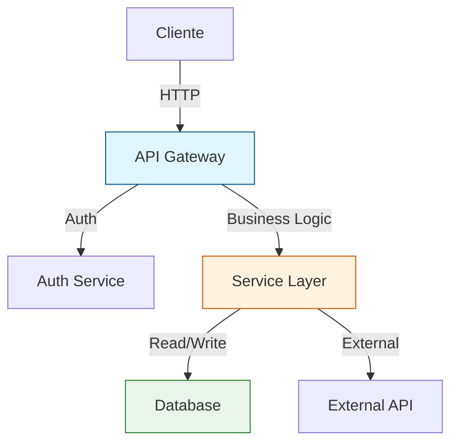
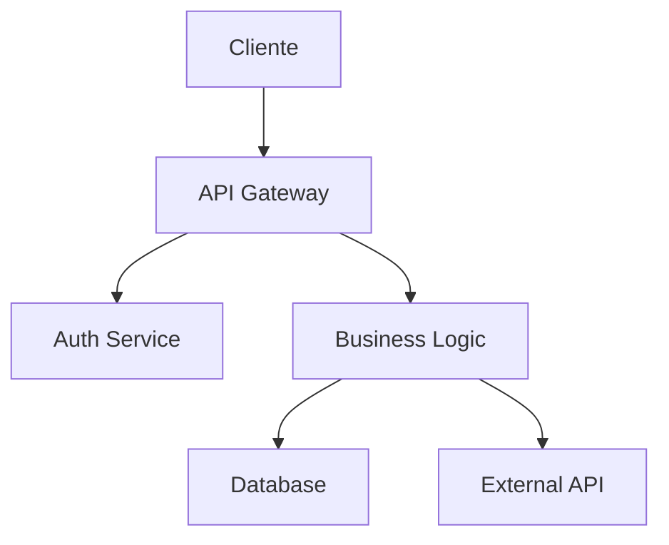

# Prompts Recomendados para Desarrollo

Estos prompts los podés usar en cualquier proyecto. Copialos y adaptalos a tu código.

---

## Code Review

```
Revisá este PR buscando:
- Memory leaks y problemas de performance
- Casos borde sin manejar
- Violaciones de principios SOLID
- Inconsistencias con el estilo del repo
- Validación de inputs insuficiente
- Manejo de errores ausente o inconsistente
- Dependencias desactualizadas con CVEs conocidos
```

---

## Migración de Código

```
Migrá este componente de [tecnología origen] a [tecnología destino]:
- Mantené funcionalidad exacta
- Adaptá patrones de la tecnología destino
- Identificá funcionalidades que no existen en destino y cómo reemplazarlas
- Explicá cada cambio importante
- Incluye migración de datos si aplica
```

---

## Documentación

```
Generá documentación profesional para esta función/módulo:
- JSDoc/TSDoc completo (@param, @returns, @throws, @example)
- README con ejemplos de uso y contexto
- Diagrama de flujo en Mermaid (si aplica)
- Lista de edge cases cubiertos
- Dependencias y requisitos
- Changelog si es una actualización
```

---

## Optimización de Performance

```
Optimizá esta función:
- Analizá complejidad temporal actual
- Reducir complejidad a O(n) o O(n log n) si es posible
- Usar estructuras de datos apropiadas (Set, Map, WeakMap, etc.)
- Explicar la ganancia de performance esperada
- Incluir benchmark comparativo simple
- Identificar si el cuello de botella está en CPU o I/O
```

---

## Testing

```
Escribí tests para esta función:
- Unit tests con Jest/Vitest/añade el framework del proyecto
- Casos de éxito y casos de error
- Edge cases: null, undefined, arrays vacíos, strings vacíos, valores límite
- Mocks para dependencias externas
- Coverage: 100% en funciones core, 80% en funciones de negocio, 0% en infraestructura
- Tests de integración si es una funcionalidad que conecta componentes
```

---

## Debugging

```
Este código tiene un bug: [describir el comportamiento inesperado]

Analizá:
1. Qué está pasando exactamente (reproduce el bug)
2. Por qué ocurre el bug (identifica la causa raíz)
3. Cómo solucionarlo (propón la solución)
4. Cómo prevenir bugs similares en el futuro (agrega validación, tests, etc.)
```

---

## Refactoring General

```
Refactorizá este código aplicando:
1. Principios SOLID (Single Responsibility, Open/Closed, Liskov Substitution, Interface Segregation, Dependency Inversion)
2. Early returns para reducir nesting
3. Extracción de funciones pequeñas y reutilizables
4. Nombres descriptivos para variables y funciones
5. Manejo de errores robusto y consistente
6. TypeScript con tipos estrictos (no usar any)
7. Eliminar código muerto o duplicado
```

---

## Seguridad

```
Revisá este código buscando vulnerabilidades:
- Inyección (SQL, NoSQL, Command)
- XSS (Cross-Site Scripting)
- CSRF (Cross-Site Request Forgery)
- Exposición de datos sensibles en logs o responses
- Validación de inputs insuficiente o ausente
- Autenticación y autorización inconsistentes
- Dependencias con CVEs conocidos
- Hardcoded secrets o credenciales
- Deserialización insegura
```

---

## API Design

```
Diseñá un endpoint REST para [funcionalidad]:
- Método HTTP correcto (GET, POST, PUT, PATCH, DELETE)
- Path siguiendo convenciones REST (singular/plural, kebab-case)
- Request body con validación (Zod, class-validator, etc.)
- Response con códigos HTTP apropiados (200, 201, 400, 401, 403, 404, 500)
- Manejo de errores consistente y documentado
- Documentación OpenAPI/Swagger o JSDoc
- Paginación si devuelve colecciones
- Rate limiting si es necesario
```

---

## SQL / Queries

```
Optimizá esta query:
- Analizá el plan de ejecución (EXPLAIN)
- Reducir tiempo de ejecución
- Usar índices apropiados o sugerir crearlos
- Evitar N+1 queries (usar JOIN o eager loading)
- Evitar SELECT * (solo columnas necesarias)
- Parameterizar queries para evitar inyección
- Considerar denormalización si mejora performance
```

---

## Git / Commits

```
Generá un mensaje de commit para estos cambios siguiendo Conventional Commits:

Formato:
<tipo>(<alcance>): <descripción>

Tipos válidos:
- feat: Nueva funcionalidad
- fix: Corrección de bug
- refactor: Refactorización sin cambio de funcionalidad
- docs: Documentación
- test: Tests
- chore: Mantenimiento (deps, config, etc.)
- perf: Optimización de performance
- style: Formateo (no cambia lógica)
- ci: Cambios en CI/CD

Ejemplos:
feat(user): add login with wallet
fix(escrow): resolve dispute calculation
refactor(core): extract common types to shared module
docs(api): add OpenAPI spec for jobs endpoint
```

---

## Arquitectura

```
Proponé una arquitectura para [sistema/feature]:
- Diagrama de componentes
- Flujo de datos (desde input hasta output)
- Patrones de diseño a usar
- Consideraciones de escalabilidad
- Trade-offs de cada decisión
- Capas definidas (presentación, negocio, datos)
- Integraciones externas identificadas

Incluir diagrama en Mermaid:

```
Proponé una arquitectura para [sistema/feature]:
- Diagrama de componentes (ver más abajo)
- Flujo de datos (desde input hasta output)
- Patrones de diseño a usar (Factory, Repository, Strategy, etc.)
- Consideraciones de escalabilidad (horizontal/vertical)
- Trade-offs de cada decisión
- Capas definidas (presentación, negocio, datos)
- Integraciones externas identificadas

Incluir diagrama en Mermaid:

```

---

## Code Generation

```
Generá código para [funcionalidad] siguiendo las convenciones del proyecto:
- Lenguaje/Framework: [especificar]
- Estructura de archivos existente: [adjuntar o referenciar]
- Patrones usados en el proyecto: [specificar]
- No incluir código muerto o no solicitado
- Incluir tipos(TypeScript) o interfaces(Rust) necesarios
- Agregar comentarios donde la lógica no es obvia
```

---

## Onboarding / Context

```
Explicá este código como si fuera un onboarding para un nuevo desarrollador:
- Propósito y contexto del módulo
- Flujo principal de ejecución
- Dependencias externas y por qué se usan
- Puntos de extensión o hooks disponibles
- Common pitfalls o errores a evitar
- Cómo ejecutar y probar localmente
```