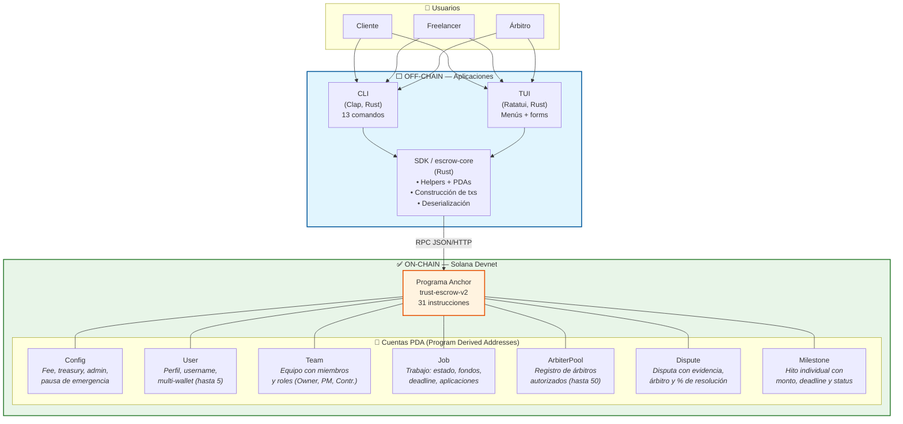
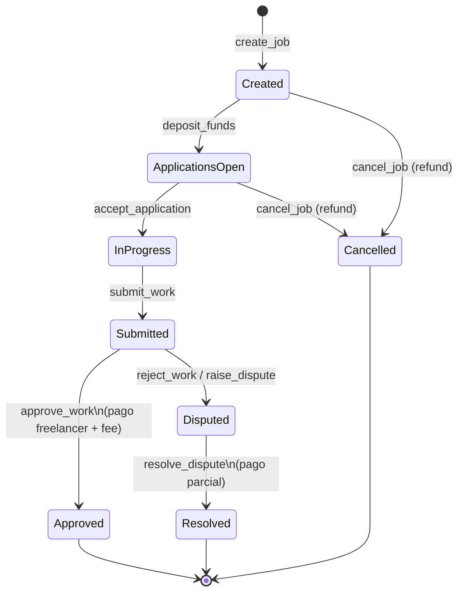
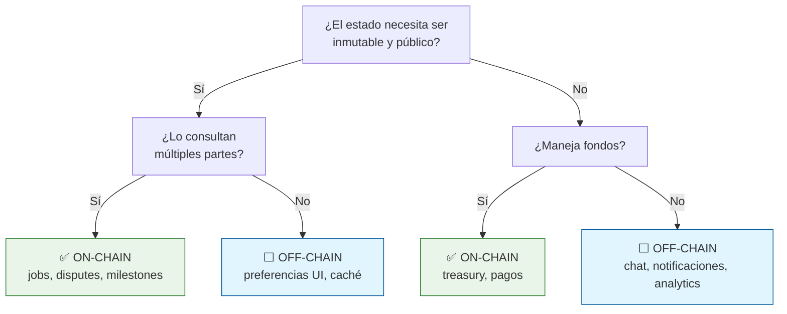
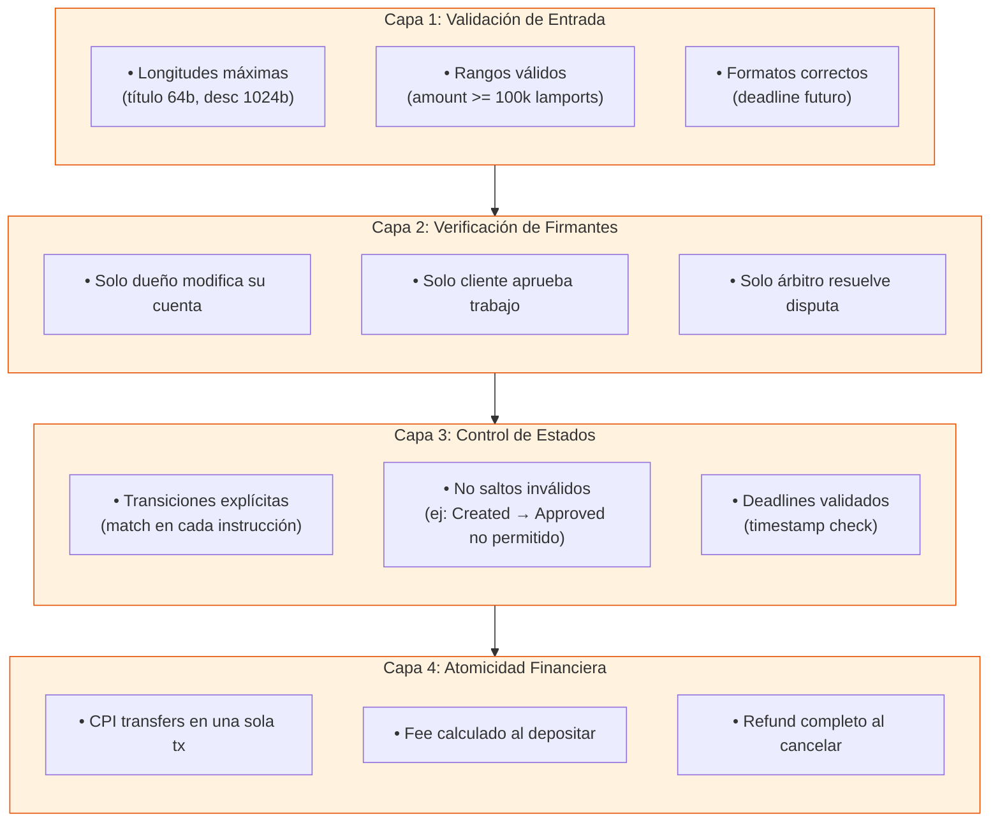

# 🏗️ Milestone 3 — Arquitectura Técnica del MVP

**Proyecto:** Trust Work Escrow  
**Fecha:** 10 de Julio, 2026  
**Programa:** WayLearn Solana Labs Incubation

---

## 1. Diagrama de Arquitectura

> Los diagramas fueron creados con **Mermaid**, la herramienta propuesta por el programa.
> Se renderizan automáticamente en GitHub, GitBook y editores markdown compatibles.

### Visión General



### Diagrama de Estados del Job



---

## 2. Componentes Principales

### 2.1 Smart Contract (Anchor) — ON-CHAIN

| Aspecto | Detalle |
|---------|---------|
| Framework | Anchor 0.32 (single file por bug de módulos anidados) |
| Deploy | Devnet: `28QTH6qfG2iKDVXNY8nUTKDjx8yrBrQpnvXCPyJsrwuA` |
| Instrucciones | 31 en total |
| Cuentas (PDAs) | Config, User, Team, Job, ArbiterPool, Dispute, Milestone |
| Fee Model | Configurable (0-100%), vault por job + treasury acumulador |
| Lenguaje | Rust + Anchor |

**Módulos del contrato:**

| Módulo | Instrucciones | Propósito |
|--------|---------------|-----------|
| Config | 5 | Init, pause/unpause, treasury management |
| User | 4 | Perfiles, multi-wallet |
| Team | 2 | Equipos de freelancers |
| Job | 8 | Ciclo de vida completo del trabajo |
| Arbiter | 3 | Pool de árbitros |
| Dispute | 5 | Resolución de disputas |
| Milestone | 4 | Entregas parciales |
| **Total** | **31** | |

### 2.2 SDK / escrow-core (Rust) — OFF-CHAIN

| Aspecto | Detalle |
|---------|---------|
| Propósito | Abstraer interacción con el contrato |
| Responsabilidades | Derivación de PDAs, construcción de txs, deserialización |
| Tests unitarios | 14 |
| Ubicación | `trust-escrow-v2/sdk/` y `trust-escrow-v2/shared/` |

### 2.3 CLI (Clap) — OFF-CHAIN

| Aspecto | Detalle |
|---------|---------|
| Framework | Clap (Rust) |
| Comandos | 13 subcomandos |
| Rol | Interfaz directa para testing y power users |
| Ubicación | `trust-escrow-v2/cli/` |

### 2.4 TUI (Ratatui) — OFF-CHAIN

| Aspecto | Detalle |
|---------|---------|
| Framework | Ratatui + Crossterm |
| Layout | 3 paneles: menú, contenido, info contextual |
| Roles | Cliente / Freelancer / Árbitro con menús específicos |
| Temas | Configuración persistente |
| Ubicación | `trust-escrow-v2/tui/` |

### 2.5 Wallet

| Tipo | Soporte |
|------|---------|
| CLI keypair (JSON) | ✅ |
| Hardware wallet (Ledger) | En desarrollo |
| Browser wallet | Futuro (Phase 3) |

---

## 3. Flujo Básico del Usuario

### Flujo Completo: Cliente → Freelancer

```
PASO 1: SETUP
─────────────
Cliente y Freelancer crean su perfil
  → create_user(username)
  → add_wallet(new_wallet) [opcional, multi-wallet]

PASO 2: PUBLICACIÓN
───────────────────
Cliente crea un trabajo
  → create_job(title, description, amount, deadline)
  → deposit_funds()  ← fondos BLOQUEADOS en escrow

PASO 3: POSTULACIÓN
───────────────────
Freelancer aplica al trabajo
  → apply_to_job(proposal)

Cliente revisa aplicaciones y acepta
  → accept_application(applicant)
  → Job pasa a "InProgress"

PASO 4: EJECUCIÓN
─────────────────
Freelancer trabaja y entrega
  → submit_work()
  → Job pasa a "Submitted"

PASO 5: CIERRE (HAPPY PATH)
───────────────────────────
Cliente aprueba la entrega
  → approve_work()
  → Fondos se liberan automáticamente al freelancer
  → Fee va al treasury
  → Job pasa a "Approved"

PASO 5B: DISPUTA (ALTERNATIVO)
──────────────────────────────
Cliente rechaza → Disputa
  → Se abre raise_dispute()
  → Ambas partes suben evidencia: submit_evidence()
  → Árbitro se asigna: assign_arbiter()
  → Árbitro resuelve: resolve_dispute(% para cliente)
  → Se ejecutan pagos parciales: finalize_dispute_payouts()

PASO 5C: CANCELACIÓN
────────────────────
Cliente cancela antes de aceptar aplicación
  → cancel_job()
  → Fondos se devuelven al cliente
```

### Flujo con Milestones (Pagos Parciales)

```
Cliente crea milestones dentro del trabajo
  → create_milestone(title, amount, deadline, index)

Por cada milestone:
  Freelancer entrega → submit_milestone()
  Cliente aprueba    → approve_milestone()  ← pago parcial liberado
  [o rechaza]        → reject_milestone()

Cuando todos los milestones están aprobados:
  → approve_work() final
```

---

## 4. Qué Está On-Chain y Qué Está Off-Chain

### ✅ ON-CHAIN (Solana Devnet)

| Componente | Explicación |
|------------|-------------|
| Estado de los trabajos | Cada job es una PDA con client, freelancer, status, amount |
| Fondos en escrow | Los SOL del trabajo se depositan en la PDA del job |
| Perfiles de usuario | PDAs con username, wallets asociadas |
| Equipos | PDAs con miembros y roles (Owner, PM, Contributor) |
| Disputas | PDAs con evidencia, árbitro asignado, % de resolución |
| Milestones | PDAs individuales por hito con status y amounts |
| Treasury | Cuenta config con fees acumulados |
| Pool de árbitros | Lista de pubkeys autorizadas para resolver disputas |

**Reglas de negocio on-chain:**
- Transiciones de estado válidas (ej: no podés approve un job que no está "Submitted")
- Verificación de firmantes (solo el cliente puede approve, solo el freelancer puede submit)
- Cálculo y transferencia de fees atómicos
- Timeouts y deadlines

### ⬜ OFF-CHAIN

| Componente | Explicación |
|------------|-------------|
| CLI/TUI | Interfaz de usuario — corre en la máquina del usuario |
| SDK helpers | Derivación de PDAs, construcción de transacciones |
| Descripciones largas | Hasta 1024 bytes on-chain, contenido más grande iría a IPFS (post-MVP) |
| Sistema de reputación | Se calcularía off-chain con datos on-chain (post-MVP) |
| Notificaciones | Push/email se manejarían off-chain (post-MVP) |
| Chat/mensajería | Entre cliente y freelancer (post-MVP) |
| Analytics/dashboards | Consultas a RPC + datos históricos (post-MVP) |

### Mapa Decisión: ¿Qué va On-Chain?



---

## 5. Principales Riesgos Técnicos

### 🔴 R1 — Seguridad del Programa Anchor

| Aspecto | Detalle |
|---------|---------|
| **Riesgo** | Bugs en validaciones de cuentas o transiciones de estado pueden permitir robos de fondos |
| **Probabilidad** | Media |
| **Impacto** | Crítico |
| **Mitigación** | ✅ Transiciones de estado explícitas en cada instrucción |
| | ✅ Verificación de firmantes en cada contexto |
| | ✅ Tests unitarios (14 actuales, plan de expandir) |
| | ⚠️ Pendiente: auditoría de seguridad formal |
| | ⚠️ Pendiente: tests de integración con casos borde |

### 🟠 R2 — Costos de Computación (Compute Units)

| Aspecto | Detalle |
|---------|---------|
| **Riesgo** | Instrucciones complejas (especialmente approve_work con transfers + verify + state changes) pueden exceder el límite de 200k CU por transacción |
| **Probabilidad** | Baja-Media |
| **Impacto** | Alto (transacciones fallan) |
| **Mitigación** | ✅ Estimaciones actuales dentro de límites (~15k CU por operación compleja) |
| | ⚠️ Monitorear en mainnet — usar Compute Budget Program si es necesario |
| | ⚠️ Milestones con muchos items pueden necesitar optimización |

### 🟠 R3 — Experiencia de Usuario en Solana

| Aspecto | Detalle |
|---------|---------|
| **Riesgo** | Usuarios no familiarizados con wallets, keypairs, RPC, o transacciones pueden abandonar |
| **Probabilidad** | Alta |
| **Impacto** | Alto (adopción) |
| **Mitigación** | ✅ CLI + TUI abstraen complejidad de Solana |
| | ✅ Manejo de errores con mensajes claros en español |
| | ⚠️ Pendiente: integración con wallet browser (Phase 3) |
| | ⚠️ Pendiente: gasless transactions con relayers (post-MVP) |

### 🟡 R4 — Dependencia de RPC

| Aspecto | Detalle |
|---------|---------|
| **Riesgo** | Si el RPC de devnet/mainnet está caído o lento, la app no funciona |
| **Probabilidad** | Media |
| **Impacto** | Alto (disponibilidad) |
| **Mitigación** | ✅ Soporte para múltiples endpoints RPC |
| | ✅ Localnet para desarrollo |
| | ⚠️ Pendiente: fallback automático entre RPCs |
| | ⚠️ Pendiente: retry policy con backoff |

### 🟡 R5 — Bug de Anchor con Módulos

| Aspecto | Detalle |
|---------|---------|
| **Riesgo** | Anchor 0.32 tiene un bug conocido con módulos anidados que fuerza todo el código a un solo `lib.rs` (~1500 líneas) |
| **Probabilidad** | Alta (ya lo estamos sufriendo) |
| **Impacto** | Medio-mantenibilidad |
| **Mitigación** | ✅ Single file funciona, es compilable y deployable |
| | ⚠️ Migrar a Anchor v1 cuando el bug esté resuelto |
| | ⚠️ Mientras tanto, mantener el archivo organizado con secciones claras |

### 🟡 R6 — Migración de Anchor 0.32 a v1

| Aspecto | Detalle |
|---------|---------|
| **Riesgo** | Anchor v1 ya está disponible con cambios breaking. Si migramos, hay que re-escribir partes del contrato |
| **Probabilidad** | Media (decisión consciente) |
| **Impacto** | Medio (esfuerzo de migración) |
| **Mitigación** | ✅ Decisión tomada: mantener 0.32 para MVP por estabilidad |
| | ⚠️ Plan de migración post-MVP cuando el ecosistema esté más maduro |

---

## 6. Decisiones Técnicas Clave

### Stack Elegido

| Capa | Tecnología | Por Qué |
|------|------------|---------|
| Smart Contract | Anchor 0.32 | IDL automático, generación de clientes, madurez |
| UI Terminal | Ratatui + Crossterm | Performance nativa, sin dependencias web, ideal para devs |
| CLI | Clap | Estándar de facto en Rust, 13 comandos |
| SDK | Rust nativo | Tipado fuerte, performance, comparte tipos con el contrato |
| Multi-wallet | Vec de Pubkeys en User PDA | Hasta 5 wallets por usuario sin deploy adicional |
| Fees | Configurables en Config PDA | Sin hardcode, ajustable por admin |

### Lo que NO está en el MVP (y está bien)

| Funcionalidad | Por qué No |
|---------------|------------|
| Tokens SPL (USDC) | Complejidad adicional, MVP se enfoca en SOL nativo |
| Gasless transactions | Infraestructura de relayers, post-MVP |
| IPFS para metadata | Almacenamiento on-chain suficiente para MVP |
| Wallet browser | El target son devs que usan terminal |
| Notificaciones push | Fuera de scope, posible integración futura |
| Sistema de reputación | Requiere volumen de datos históricos |

---

## 7. Resumen de Costos y Límites

### Límites del Programa

| Recurso | Límite MVP | Justificación |
|---------|------------|---------------|
| Título del job | 64 bytes | Suficiente para describir el trabajo |
| Descripción | 1024 bytes | Amplio para especificaciones |
| Propuesta al aplicar | 512 bytes | Breve pero sustanciosa |
| Evidencia de disputa | 2048 bytes | Suficiente para documento de texto |
| Username | 32 bytes | Estándar |
| Milestones por job | 20 | Suficiente para proyectos por hitos |
| Miembros por equipo | 20 | Equipos grandes cubiertos |
| Wallets por usuario | 5 | Multi-wallet sin abusar |
| Árbitros en pool | 50 | Escalable para MVP |
| Fee máximo | 100% | Configurable por admin (se recomienda 5-10%) |

### Costos Estimados de Transacción

| Operación | Compute Units Est. | SOL (aprox) |
|-----------|-------------------|-------------|
| create_user | ~5,000 | ~0.000005 |
| create_job | ~10,000 | ~0.00001 |
| deposit_funds | ~15,000 | ~0.000015 |
| apply_to_job | ~8,000 | ~0.000008 |
| accept_application | ~8,000 | ~0.000008 |
| submit_work | ~5,000 | ~0.000005 |
| approve_work | ~20,000 | ~0.00002 |
| raise_dispute | ~10,000 | ~0.00001 |
| resolve_dispute | ~8,000 | ~0.000008 |
| create_milestone | ~8,000 | ~0.000008 |
| approve_milestone | ~15,000 | ~0.000015 |

---

## 8. Seguridad — Modelo de Confianza

### Capas de Seguridad



### Modelo de Confianza (Trust Model)

| Actor | Confianza | Qué Puede Hacer |
|-------|-----------|-----------------|
| Admin | Alta | Pausar programa, retirar treasury, gestionar árbitros |
| Cliente | Media | Crear/cancelar jobs, aceptar aplicaciones, aprobar/rechazar |
| Freelancer | Media | Aplicar, entregar trabajo, recibir pagos |
| Árbitro | Alta (designado) | Resolver disputas, asignar pagos parciales |
| Cualquiera | Baja | Leer estado on-chain |

---

## 9. Plan de Implementación Técnica

### Sprint 1 (Semana 1-2 Jul) — Fundación ✅ COMPLETADO
- ✅ Programa Anchor con configuración y users
- ✅ Ciclo básico de jobs (create → fund → apply → accept → work → approve)
- ✅ Deploy a devnet

### Sprint 2 (Semana 3-4 Jul) — Features Avanzadas ✅ COMPLETADO
- ✅ Teams
- ✅ Disputas + Árbitros
- ✅ Milestones con pagos parciales
- ✅ Treasury management

### Sprint 3 (Semana 1-2 Ago) — Tests y Robustez 🔲 PENDIENTE
- [ ] Tests de integración con solana-test-validator
- [ ] Tests de casos borde (deadlines, disputas, refunds)
- [ ] Fuzzing de inputs
- [ ] Generar IDL completo

### Sprint 4 (Semana 3-4 Ago) — UX y Documentación 🔲 PENDIENTE
- [ ] Mejorar mensajes de error en el contrato
- [ ] Documentación técnica completa
- [ ] Guías de usuario para CLI y TUI
- [ ] Ejemplos de integración

---

## Apéndice A: Glosario Técnico

| Término | Definición |
|---------|------------|
| **PDA** | Program Derived Address — dirección generada por seeds, sin private key |
| **Anchor** | Framework para desarrollo de programas Solana en Rust |
| **CPI** | Cross-Program Invocation — llamada de un programa a otro |
| **RPC** | Remote Procedure Call — comunicación con el nodo Solana |
| **Lamport** | Unidad más pequeña de SOL (1 SOL = 1,000,000,000 lamports) |
| **CU** | Compute Unit — unidad de cómputo por transacción (límite 200k) |
| **IDL** | Interface Description Language — schema de las instrucciones del programa |
| **Devnet** | Red de pruebas de Solana (SOL gratis de faucet) |
| **Mainnet** | Red de producción de Solana (SOL real) |
| **Escrow** | Contrato donde un tercero retiene fondos hasta cumplir condiciones |

---

## Apéndice B: Referencias

| Recurso | Link |
|---------|------|
| Código fuente | `https://github.com/...` |
| Contrato deployado | Devnet: `28QTH6qfG2iKDVXNY8nUTKDjx8yrBrQpnvXCPyJsrwuA` |
| Anchor docs | `https://www.anchor-lang.com/` |
| Solana docs | `https://docs.solana.com/` |
| Diagrama de arquitectura completo | `docs/architecture/ARQUITECTURA.md` |
| Documentación del smart contract | `programs/trust-escrow-v2/docs/INSTRUCTIONS.md` |
| Guía de diagramas del programa | `incubacion/referencias/04-diagrama-arquitectura-guia.md` |
| Mermaid (herramienta de diagramas) | `https://mermaid.js.org/` |

> **Nota:** Todos los diagramas de este documento fueron creados con **Mermaid**, siguiendo la herramienta propuesta por el programa WayLearn (ver [guía de diagrama de arquitectura](../../referencias/04-diagrama-arquitectura-guia.md)). Se renderizan automáticamente en GitHub, GitBook y editores markdown. También se recomienda [IcePanel](https://icepanel.io/) y [C4 Model](https://c4model.com/) para diagramas más detallados en fases posteriores.
