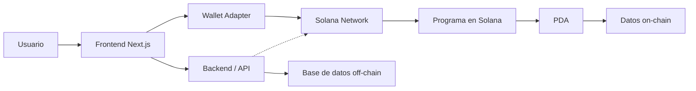

# 📐 Diagrama de Arquitectura — Guía del Programa

**Fuente:** WayLearn GitBook — Recursos de Desarrollo  
**URL:** https://waylearn.gitbook.io/solana-latam-labs-program-waylearn/recursos-de-desarrollo/diagrama-de-arquitectura  
**Relevante para:** Milestone 3 (10 Julio)

---

## ¿Qué es?

Un diagrama de arquitectura representa de forma visual y ordenada cómo se conectan las partes del sistema y qué rol cumple cada una. No es un detalle técnico del código, sino una vista general de:

- Qué componentes existen
- Cómo se comunican entre ellos
- Dónde ocurre la integración con Solana

---

## ¿Qué debe incluir?

- Frontend o app web/mobile
- Wallet del usuario
- Wallet Adapter o mecanismo de conexión
- Programa o smart contract en Solana
- Cuentas on-chain, PDAs, estados en Solana
- Backend o API (si aplica)
- Base de datos off-chain (si aplica)
- Servicios externos (indexers, oráculos, APIs)
- Flujo general de interacción usuario → sistema

---

## Ejemplo del programa (app biblioteca en Solana)

---

## Recursos recomendados

| Recurso | Link |
|---------|------|
| C4 Model | https://c4model.com/ |
| IcePanel | https://icepanel.io/ |
| Guía de diagramas arquitectónicos | https://nulab.com/learn/software-development/architectural-diagrams-what-to-know-and-how-to-draw-one/ |
| Blockchain architecture guide | https://medium.com/mobindustry/designing-a-blockchain-architecture-types-use-cases-and-challenges-9894fb7b58e |
| Web3 architecture | https://medium.com/mobilepeople/web3-series-decentralized-applications-architecture-2ddda34e674e |
| Solana architecture diagram | https://www.researchgate.net/figure/Detailed-architectural-diagram-of-Solanas-components_fig2_382785733 |
| Mobile Wallet Adapter diagrams | https://docs.solanamobile.com/mobile-wallet-adapter/diagrams |
