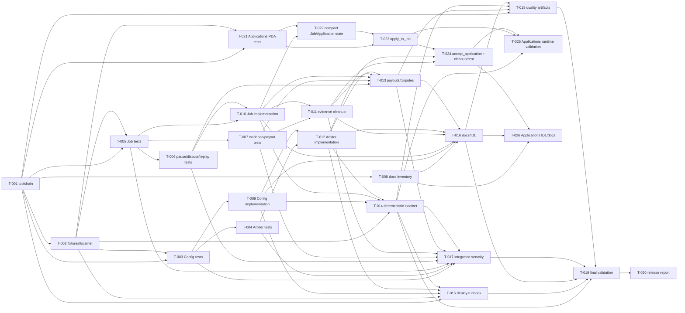

# Build Site: trust-escrow-v3 remediation

> Mapa generado desde todos los kits de `context/kits/`. Este artefacto es un
> plan: no implementa código, no regenera IDL y no ejecuta deploy.

## Routing

- **Depth global:** `thorough` — seguridad on-chain, payout, autoridad,
  reproducibilidad y cambio cross-cutting.
- **Presupuesto orientativo:** quick 8k, standard 20k, thorough 45k tokens por
  task, según complejidad individual.
- **Orden obligatorio:** tests/fixtures antes de la implementación; gates de
  seguridad y reproducibilidad son first-class tasks.
- **Baseline:** ejecutar desde `trust-escrow-v3/`.

## Waves

Las tareas dentro de una wave son paralelizables. Una tarea solo depende de
tareas de waves anteriores; no hay dependencias ocultas entre tareas de la

### Wave 0 — Toolchain baseline

| Task | Title | Deps | Spec | Files objetivo | Tests primero | Effort |
|---|---|---|---|---|---|---|
| T-001 | Alinear Anchor, Rust, JS y manifests | — | `06-reproducibility.md` R1 | `Anchor.toml`, `package.json`, `Cargo.toml`, `programs/trust-escrow-v3/Cargo.toml`, `Cargo.lock`, `rust-toolchain.toml`, `yarn.lock` | Test/check de versiones declaradas vs efectivas; reproduce el drift Anchor JS `0.32.1` vs crates `0.30.0` | T |

### Wave 1 — Fixtures base (antes de código)

| Task | Title | Deps | Spec | Files objetivo | Tests primero | Effort |
|---|---|---|---|---|---|---|
| T-002 | Fixtures sanitizados de advisor, authorities y localnet | T-001 | `06-reproducibility.md` R2–R3 | `tests/fixtures/**`, `tests/helpers/**`, `Anchor.toml`, `.gitignore`, `runbooks/` | Prueba que faltan identidades falla de forma accionable; verifica advisor por public key y endpoint localnet | S |

### Wave 2 — Contratos de prueba independientes (antes de código)

| Task | Title | Deps | Spec | Files objetivo | Tests primero | Effort |
|---|---|---|---|---|---|---|
| T-003 | Tests primero de bootstrap Config y anti-frontrun | T-001, T-002 | `01-config-bootstrap.md` R1–R3; `05-security-tests.md` R1 | `tests/escrow.ts`, `tests/security/config-bootstrap.ts` | Autorizado/no autorizado, doble init, init concurrente, parámetros inválidos, treasury/fee incorrectos, sin mutación parcial | T |
| T-005 | Tests primero de Job, Submitted y deadline | T-001, T-002 | `03-deadlines-auto-approval.md` R1–R2 | `tests/escrow.ts`, `tests/state/job-submitted.ts` | `submit_work → Submitted`, ausencia de `Received`, 7 días desde `submitted_at`, antes/exacto/después, approve/reject/dispute | T |
| T-021 | Tests primero del modelo Applications PDA individual | T-001, T-002 | `03-deadlines-auto-approval.md` R6; `05-security-tests.md` R6 | `tests/state/applications.ts`, `tests/security/applications-pda.ts` | `create_job`, `apply_to_job`, `accept_application`; seeds/index/applicant/ownership, texto, duplicados, 0/1/50/51, cleanup/rent y ausencia de mutación parcial | T |
| T-008 | Inventario documental y contrato de sincronización | T-001 | `07-docs-idl-sync.md` R1 | `docs/contract/**`, `docs/escenarios/**`, `README.md`, `target/idl/**` | Checks que estados/cuentas/constantes documentadas tienen fuente verificable; no agrega requisitos nuevos | S |

### Wave 3 — Contratos de prueba dependientes

| Task | Title | Deps | Spec | Files objetivo | Tests primero | Effort |
|---|---|---|---|---|---|---|
| T-004 | Tests primero de autoridad ArbiterPool | T-003 | `02-arbiter-governance.md` R1–R2 | `tests/security/arbiter-governance.ts`, `tests/helpers/**` | Pool creado solo por `Config.authority`, pool global único, add/remove, duplicados, límite y autoridad incorrecta | T |
| T-006 | Tests primero de pause, disputa y terminales | T-005 | `03-deadlines-auto-approval.md` R4–R5; `05-security-tests.md` R2–R3 | `tests/state/job-exceptions.ts`, `tests/security/replay-clock.ts` | Pause solo `Created`/`Funded` sin freelancer; dispute bloquea; replay, concurrencia, overflow y timestamp límite | T |
| T-007 | Tests primero de evidence cleanup y conservación económica | T-005 | `05-security-tests.md` R4–R5 | `tests/security/evidence-cleanup.ts`, `tests/security/payout-conservation.ts` | Evidence PDA individual, límites, cleanup terminal, doble payout, rent, fee, treasury, arbitraje y shortfall | T |

### Wave 4 — Implementación base de Config y Job

| Task | Title | Deps | Spec | Files objetivo | Tests primero | Effort |
|---|---|---|---|---|---|---|
| T-009 | Bootstrap autorizado e idempotente de Config | T-003 | `01-config-bootstrap.md` R1–R4 | `programs/trust-escrow-v3/src/lib.rs`, `programs/trust-escrow-v3/src/state/**`, `programs/trust-escrow-v3/src/error.rs` | Debe hacer pasar T-003; signer/allowlist o bootstrap protegido, una sola init, validación de advisor/treasuries/fee, rotación autorizada | T |
| T-010 | Semántica Job Submitted, auto-aprobación y pause | T-005, T-006 | `03-deadlines-auto-approval.md` R1–R5 | `programs/trust-escrow-v3/src/lib.rs`, `programs/trust-escrow-v3/src/state/**`, `programs/trust-escrow-v3/src/error.rs` | Debe hacer pasar T-005/T-006; deadline exacto `604800`, clock seguro, disputa bloqueante, pause acotado, terminal idempotente | T |

### Wave 4A — Modelo compacto de Applications PDA

| Task | Title | Deps | Spec | Files objetivo | Tests primero | Effort |
|---|---|---|---|---|---|---|
| T-022 | Job compacto y estado de Application PDA | T-010, T-021 | `03-deadlines-auto-approval.md` R6 | `programs/trust-escrow-v3/src/state/**`, `src/lib.rs`, `src/error.rs` | Debe demostrar que `create_job` no reserva una colección inline sobredimensionada; cuenta compacta, contador/límites y seeds/bump definidos | T |

### Wave 5 — Cleanup y gobernanza

| Task | Title | Deps | Spec | Files objetivo | Tests primero | Effort |
|---|---|---|---|---|---|---|
| T-011 | Evidence PDA y cleanup terminal | T-007, T-010 | `03-deadlines-auto-approval.md` R3–R4; `05-security-tests.md` R4 | `programs/trust-escrow-v3/src/lib.rs`, `programs/trust-escrow-v3/src/state/**` | Debe hacer pasar T-007 sobre ownership, límites, cierre y devolución de rent sin cuentas huérfanas | T |
| T-012 | ArbiterPool ligado a Config.authority | T-004, T-009 | `02-arbiter-governance.md` R1–R4 | `programs/trust-escrow-v3/src/lib.rs`, `src/state/**`, `src/error.rs` | Debe hacer pasar T-004; autoridad de Config en create/add/remove/assign, neutralidad y fee treasury correcto | T |
| T-023 | `apply_to_job` y validaciones on-chain | T-021, T-022 | `03-deadlines-auto-approval.md` R6; `05-security-tests.md` R6 | `programs/trust-escrow-v3/src/lib.rs`, `src/state/**`, `src/error.rs` | PDA individual determinista; seeds/index/applicant/Job/ownership, signer, permisos, texto vacío/excesivo, duplicados y máximo exacto 50 | T |

### Wave 6 — Payouts y reproducibilidad integrada

| Task | Title | Deps | Spec | Files objetivo | Tests primero | Effort |
|---|---|---|---|---|---|---|
| T-013 | Payouts, disputas, milestones y conservación | T-006, T-007, T-010, T-011, T-012 | `03-deadlines-auto-approval.md` R2–R4; `05-security-tests.md` R2–R5 | `programs/trust-escrow-v3/src/lib.rs`, `src/state/**`, `src/error.rs` | Debe hacer pasar pruebas negativas, replay, disputa unilateral/mutua, fee exacto, remaining amount, cierre y cleanup | T |
| T-014 | Suite localnet determinista y advisor reproducible | T-002, T-009, T-010, T-012 | `06-reproducibility.md` R2–R4 | `Anchor.toml`, `tests/**`, `runbooks/localnet.md`, `scripts/**`, `package.json` | Dos ejecuciones desde estado limpio; no devnet/mainnet; clippy/build sin warnings nuevos y fixtures sin secretos | T |
| T-024 | `accept_application` y cleanup/rent del ciclo de vida | T-011, T-012, T-023 | `03-deadlines-auto-approval.md` R6; `05-security-tests.md` R6 | `programs/trust-escrow-v3/src/lib.rs`, `src/state/**`, `src/error.rs` | Solo cliente autorizado acepta Pending del Job/índice correctos; accepted/rejected/withdrawn y cierre terminal cierran o retienen explícitamente la PDA, rent al destinatario correcto y sin payout de rent | T |

### Wave 7 — Operación, artefactos y cobertura integrada

| Task | Title | Deps | Spec | Files objetivo | Tests primero | Effort |
|---|---|---|---|---|---|---|
| T-015 | Runbook de deploy, bootstrap y verificación de identidad | T-001, T-002, T-009, T-012, T-014 | `04-deploy-runbook.md` R1–R4 | `runbooks/deployment/main.tx`, `runbooks/deployment/**`, `scripts/deploy*.js`, `Anchor.toml`, `README.md` | Preflight falla ante endpoint/program ID/keypair/authority mismatch; deploy→initialize→readback; re-run no takeover; SHA-256 y upgrade authority | T |
| T-016 | Regenerar y sincronizar IDL, docs y escenarios | T-008, T-009, T-010, T-011, T-012, T-013 | `07-docs-idl-sync.md` R1–R4 | `target/idl/**`, `target/types/**`, `docs/contract/**`, `docs/escenarios/**`, `README.md` | Build/IDL diff explicado; estados `Submitted`, ausencia de `Received`, seeds/evidence/cleanup, fees y cuentas coinciden con código | S |
| T-017 | Integración de negativos, estados, replay y payouts | T-003, T-004, T-005, T-006, T-007, T-011, T-013, T-014 | `05-security-tests.md` R1–R5 | `tests/escrow.ts`, `tests/security/**`, `tests/state/**` | Suite completa con códigos de error, balances/estado invariantes, todos los estados, destinos, replay/concurrencia y conservación | T |
| T-025 | Validación runtime de Applications PDA y límite 50 | T-014, T-023, T-024 | `08-final-validation.md` R5; `05-security-tests.md` R6 | `tests/state/applications.ts`, `tests/security/applications-pda.ts`, `context/validation/**` | Localnet/Surfpool prueba cero, una y 50 postulaciones; 51, índices/cuentas cruzadas, duplicados, texto, cleanup/rent y balances sin mutación parcial | T |

### Wave 8 — Gate de calidad estática

| Task | Title | Deps | Spec | Files objetivo | Tests primero | Effort |
|---|---|---|---|---|---|---|
| T-018 | Gate de calidad estática y artefactos reproducibles | T-001, T-013, T-014, T-016, T-026 | `06-reproducibility.md` R4; `07-docs-idl-sync.md` R3–R5 | `package.json`, `Cargo.toml`, CI/config si existe, `README.md`, `target/idl/**` | `yarn build`, `cargo clippy --all-targets --all-features -- -D warnings`, diff de artefactos y comandos/versiones documentados | S |
| T-026 | IDL/docs del modelo Applications PDA individual | T-008, T-016, T-024 | `07-docs-idl-sync.md` R5 | `target/idl/**`, `target/types/**`, `docs/contract/**`, `docs/escenarios/**`, `README.md` | IDL, seeds/ownership/bump, argumentos/cuentas, `MAX_APPLICATIONS = 50`, límites de texto, unicidad y cleanup/rent sin referencias al modelo inline | S |

### Wave 9 — Release validation

| Task | Title | Deps | Spec | Files objetivo | Tests primero | Effort |
|---|---|---|---|---|---|---|
| T-019 | Validación final funcional, económica y de deploy | T-014, T-015, T-016, T-017, T-018, T-025, T-026 | `08-final-validation.md` R1–R5 | `context/validation/**`, `runbooks/**`, `tests/**`, `target/idl/**` | `yarn build`, clippy, `yarn test`, `anchor test --provider.cluster localnet`, Surfpool advisor/deploy y matriz de estados/payouts/Applications PDA | T |

### Wave 10 — Reporte de release

| Task | Title | Deps | Spec | Files objetivo | Tests primero | Effort |
|---|---|---|---|---|---|---|
| T-020 | Reporte PASS/FAIL/BLOCKED y decisión de release | T-019 | `08-final-validation.md` R4 + Security Gates | `context/validation/final-report.md`, `context/validation/coverage-matrix.md` | Cada hallazgo/gate tiene evidencia, responsable siguiente, comandos, versiones, hashes y fecha; cualquier FAIL crítico bloquea release | S |

## Coverage Matrix

Cada rango `Rk.i–Rk.j` representa **cada acceptance criterion individual** del
kit, no solo el encabezado del requirement. Los conteos fueron verificados al
leer los ocho kits: **175 acceptance criteria + 33 security gates = 208 puntos**.

| Kit | Acceptance criteria cubiertos | Security gates cubiertos | Tasks |
|---|---:|---:|---|
| R1 `01-config-bootstrap` | R1.1–R1.4, R2.1–R2.4, R3.1–R3.4, R4.1–R4.8 | S1–S4 | T-003, T-009, T-014, T-015, T-017, T-019, T-020 |
| R2 `02-arbiter-governance` | R1.1–R1.4, R2.1–R2.4, R3.1–R3.4, R4.1–R4.8 | S1–S4 | T-004, T-012, T-013, T-017, T-019, T-020 |
| R3 `03-deadlines-auto-approval` | R1.1–R1.5, R2.1–R2.4, R3.1–R3.4, R4.1–R4.4, R5.1–R5.8, R6.1–R6.9 | S1–S4 | T-005, T-006, T-010, T-011, T-013, T-017, T-019, T-020, T-021, T-022, T-023, T-024 |
| R4 `04-deploy-runbook` | R1.1–R1.4, R2.1–R2.4, R3.1–R3.4, R4.1–R4.9 | S1–S4 | T-002, T-014, T-015, T-019, T-020 |
| R5 `05-security-tests` | R1.1–R1.4, R2.1–R2.7, R3.1–R3.4, R4.1–R4.4, R5.1–R5.8, R6.1–R6.8 | S1–S4 | T-003, T-004, T-006, T-007, T-011, T-013, T-017, T-019, T-020, T-021, T-023, T-024, T-025 |
| R6 `06-reproducibility` | R1.1–R1.4, R2.1–R2.4, R3.1–R3.4, R4.1–R4.8 | S1–S4 | T-001, T-002, T-014, T-018, T-019, T-020 |
| R7 `07-docs-idl-sync` | R1.1–R1.5, R2.1–R2.4, R3.1–R3.4, R4.1–R4.8, R5.1–R5.8 | S1–S4 | T-008, T-016, T-018, T-019, T-020, T-026 |
| R8 `08-final-validation` | R1.1–R1.4, R2.1–R2.4, R3.1–R3.4, R4.1–R4.9, R5.1–R5.5 | S1–S5 | T-017, T-018, T-019, T-020, T-025, T-026 |

**Coverage check: 208/208 criteria + gates mapped. R3/R5/R7/R8 Applications PDA criteria are explicitly mapped; no gap detected.**

## Dependency graph

## Capability notes

The environment exposes `anchor`, `solana`, `rustc`, `cargo`, `node`, `npm`,
`pnpm`, `yarn`, `docker`, `surfpool` and `avm`. No `.cavekit/capabilities.json`
was present, so the map records only observed executables and does not invent
MCP/API capabilities. T-001/T-002 remain the setup boundary for any missing
CI or secret-free fixture capability.

## Result

**26 tasks across 12 waves. Coverage: 208/208 criteria + gates mapped. Next: `/sdd-cavekit make`.**
