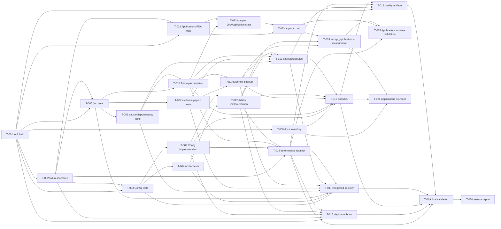

# Build Site: trust-escrow-v3 remediation + shared trust-escrow-sdk boundary

> Mapa generado desde todos los kits de `context/kits/`. Este artefacto es un
> plan: no implementa código, no regenera IDL y no ejecuta deploy.

## Routing

- **Depth global:** `thorough` — seguridad on-chain, payout, autoridad,
  reproducibilidad y cambio cross-cutting.
- **Estrategia:** `quality` — pipeline profundo, security gates primero,
  trazabilidad por criterio y validación independiente por capa.
- **Presupuesto orientativo:** quick 8k, standard 20k, thorough 45k tokens por
  task, según complejidad individual.
- **Orden obligatorio:** tests/fixtures antes de la implementación; gates de
  seguridad y reproducibilidad son first-class tasks.
- **Baseline:** ejecutar desde `trust-escrow-v3/`.

## Waves

Las tareas dentro de una wave son paralelizables. Una tarea solo depende de
tareas de waves anteriores; no hay dependencias ocultas entre tareas de la

### Wave 0 — Toolchain baseline

| Task | Title | Deps | Spec | Files objetivo | Tests primero | Effort |
|---|---|---|---|---|---|---|
| T-001 | Alinear Anchor, Rust, JS y manifests | — | `06-reproducibility.md` R1 | `Anchor.toml`, `package.json`, `Cargo.toml`, `programs/trust-escrow-v3/Cargo.toml`, `Cargo.lock`, `rust-toolchain.toml`, `yarn.lock` | Test/check de versiones declaradas vs efectivas; reproduce el drift Anchor JS `0.32.1` vs crates `0.30.0` | T |

### Wave 1 — Fixtures base (antes de código)

| Task | Title | Deps | Spec | Files objetivo | Tests primero | Effort |
|---|---|---|---|---|---|---|
| T-002 | Fixtures sanitizados de advisor, authorities y localnet | T-001 | `06-reproducibility.md` R2–R3 | `tests/fixtures/**`, `tests/helpers/**`, `Anchor.toml`, `.gitignore`, `runbooks/` | Prueba que faltan identidades falla de forma accionable; verifica advisor por public key y endpoint localnet | S |

### Wave 2 — Contratos de prueba independientes (antes de código)

| Task | Title | Deps | Spec | Files objetivo | Tests primero | Effort |
|---|---|---|---|---|---|---|
| T-003 | Tests primero de bootstrap Config y anti-frontrun | T-001, T-002 | `01-config-bootstrap.md` R1–R3; `05-security-tests.md` R1 | `tests/escrow.ts`, `tests/security/config-bootstrap.ts` | Autorizado/no autorizado, doble init, init concurrente, parámetros inválidos, treasury/fee incorrectos, sin mutación parcial | T |
| T-005 | Tests primero de Job, Submitted y deadline | T-001, T-002 | `03-deadlines-auto-approval.md` R1–R2 | `tests/escrow.ts`, `tests/state/job-submitted.ts` | `submit_work → Submitted`, ausencia de `Received`, 7 días desde `submitted_at`, antes/exacto/después, approve/reject/dispute | T |
| T-021 | Tests primero del modelo Applications PDA individual | T-001, T-002 | `03-deadlines-auto-approval.md` R6; `05-security-tests.md` R6 | `tests/state/applications.ts`, `tests/security/applications-pda.ts` | `create_job`, `apply_to_job`, `accept_application`; seeds/index/applicant/ownership, texto, duplicados, 0/1/50/51, cleanup/rent y ausencia de mutación parcial | T |
| T-008 | Inventario documental y contrato de sincronización | T-001 | `07-docs-idl-sync.md` R1 | `docs/contract/**`, `docs/escenarios/**`, `README.md`, `target/idl/**` | Checks que estados/cuentas/constantes documentadas tienen fuente verificable; no agrega requisitos nuevos | S |

### Wave 3 — Contratos de prueba dependientes

| Task | Title | Deps | Spec | Files objetivo | Tests primero | Effort |
|---|---|---|---|---|---|---|
| T-004 | Tests primero de autoridad ArbiterPool | T-003 | `02-arbiter-governance.md` R1–R2 | `tests/security/arbiter-governance.ts`, `tests/helpers/**` | Pool creado solo por `Config.authority`, pool global único, add/remove, duplicados, límite y autoridad incorrecta | T |
| T-006 | Tests primero de pause, disputa y terminales | T-005 | `03-deadlines-auto-approval.md` R4–R5; `05-security-tests.md` R2–R3 | `tests/state/job-exceptions.ts`, `tests/security/replay-clock.ts` | Pause solo `Created`/`Funded` sin freelancer; dispute bloquea; replay, concurrencia, overflow y timestamp límite | T |
| T-007 | Tests primero de evidence cleanup y conservación económica | T-005 | `05-security-tests.md` R4–R5 | `tests/security/evidence-cleanup.ts`, `tests/security/payout-conservation.ts` | Evidence PDA individual, límites, cleanup terminal, doble payout, rent, fee, treasury, arbitraje y shortfall | T |

### Wave 4 — Implementación base de Config y Job

| Task | Title | Deps | Spec | Files objetivo | Tests primero | Effort |
|---|---|---|---|---|---|---|
| T-009 | Bootstrap autorizado e idempotente de Config | T-003 | `01-config-bootstrap.md` R1–R4 | `programs/trust-escrow-v3/src/lib.rs`, `programs/trust-escrow-v3/src/state/**`, `programs/trust-escrow-v3/src/error.rs` | Debe hacer pasar T-003; signer/allowlist o bootstrap protegido, una sola init, validación de advisor/treasuries/fee, rotación autorizada | T |
| T-010 | Semántica Job Submitted, auto-aprobación y pause | T-005, T-006 | `03-deadlines-auto-approval.md` R1–R5 | `programs/trust-escrow-v3/src/lib.rs`, `programs/trust-escrow-v3/src/state/**`, `programs/trust-escrow-v3/src/error.rs` | Debe hacer pasar T-005/T-006; deadline exacto `604800`, clock seguro, disputa bloqueante, pause acotado, terminal idempotente | T |

### Wave 4A — Modelo compacto de Applications PDA

| Task | Title | Deps | Spec | Files objetivo | Tests primero | Effort |
|---|---|---|---|---|---|---|
| T-022 | Job compacto y estado de Application PDA | T-010, T-021 | `03-deadlines-auto-approval.md` R6 | `programs/trust-escrow-v3/src/state/**`, `src/lib.rs`, `src/error.rs` | Debe demostrar que `create_job` no reserva una colección inline sobredimensionada; cuenta compacta, contador/límites y seeds/bump definidos | T |

### Wave 5 — Cleanup y gobernanza

| Task | Title | Deps | Spec | Files objetivo | Tests primero | Effort |
|---|---|---|---|---|---|---|
| T-011 | Evidence PDA y cleanup terminal | T-007, T-010 | `03-deadlines-auto-approval.md` R3–R4; `05-security-tests.md` R4 | `programs/trust-escrow-v3/src/lib.rs`, `programs/trust-escrow-v3/src/state/**` | Debe hacer pasar T-007 sobre ownership, límites, cierre y devolución de rent sin cuentas huérfanas | T |
| T-012 | ArbiterPool ligado a Config.authority | T-004, T-009 | `02-arbiter-governance.md` R1–R4 | `programs/trust-escrow-v3/src/lib.rs`, `src/state/**`, `src/error.rs` | Debe hacer pasar T-004; autoridad de Config en create/add/remove/assign, neutralidad y fee treasury correcto | T |
| T-023 | `apply_to_job` y validaciones on-chain | T-021, T-022 | `03-deadlines-auto-approval.md` R6; `05-security-tests.md` R6 | `programs/trust-escrow-v3/src/lib.rs`, `src/state/**`, `src/error.rs` | PDA individual determinista; seeds/index/applicant/Job/ownership, signer, permisos, texto vacío/excesivo, duplicados y máximo exacto 50 | T |

### Wave 6 — Payouts y reproducibilidad integrada

| Task | Title | Deps | Spec | Files objetivo | Tests primero | Effort |
|---|---|---|---|---|---|---|
| T-013 | Payouts, disputas, milestones y conservación | T-006, T-007, T-010, T-011, T-012 | `03-deadlines-auto-approval.md` R2–R4; `05-security-tests.md` R2–R5 | `programs/trust-escrow-v3/src/lib.rs`, `src/state/**`, `src/error.rs` | Debe hacer pasar pruebas negativas, replay, disputa unilateral/mutua, fee exacto, remaining amount, cierre y cleanup | T |
| T-014 | Suite localnet determinista y advisor reproducible | T-002, T-009, T-010, T-012 | `06-reproducibility.md` R2–R4 | `Anchor.toml`, `tests/**`, `runbooks/localnet.md`, `scripts/**`, `package.json` | Dos ejecuciones desde estado limpio; no devnet/mainnet; clippy/build sin warnings nuevos y fixtures sin secretos | T |
| T-024 | `accept_application` y cleanup/rent del ciclo de vida | T-011, T-012, T-023 | `03-deadlines-auto-approval.md` R6; `05-security-tests.md` R6 | `programs/trust-escrow-v3/src/lib.rs`, `src/state/**`, `src/error.rs` | Solo cliente autorizado acepta Pending del Job/índice correctos; accepted/rejected/withdrawn y cierre terminal cierran o retienen explícitamente la PDA, rent al destinatario correcto y sin payout de rent | T |

### Wave 7 — Operación, artefactos y cobertura integrada

| Task | Title | Deps | Spec | Files objetivo | Tests primero | Effort |
|---|---|---|---|---|---|---|
| T-015 | Runbook de deploy, bootstrap y verificación de identidad | T-001, T-002, T-009, T-012, T-014 | `04-deploy-runbook.md` R1–R4 | `runbooks/deployment/main.tx`, `runbooks/deployment/**`, `scripts/deploy*.js`, `Anchor.toml`, `README.md` | Preflight falla ante endpoint/program ID/keypair/authority mismatch; deploy→initialize→readback; re-run no takeover; SHA-256 y upgrade authority | T |
| T-016 | Regenerar y sincronizar IDL, docs y escenarios | T-008, T-009, T-010, T-011, T-012, T-013 | `07-docs-idl-sync.md` R1–R4 | `target/idl/**`, `target/types/**`, `docs/contract/**`, `docs/escenarios/**`, `README.md` | Build/IDL diff explicado; estados `Submitted`, ausencia de `Received`, seeds/evidence/cleanup, fees y cuentas coinciden con código | S |
| T-017 | Integración de negativos, estados, replay y payouts | T-003, T-004, T-005, T-006, T-007, T-011, T-013, T-014 | `05-security-tests.md` R1–R5 | `tests/escrow.ts`, `tests/security/**`, `tests/state/**` | Suite completa con códigos de error, balances/estado invariantes, todos los estados, destinos, replay/concurrencia y conservación | T |
| T-025 | Validación runtime de Applications PDA y límite 50 | T-014, T-023, T-024 | `08-final-validation.md` R5; `05-security-tests.md` R6 | `tests/state/applications.ts`, `tests/security/applications-pda.ts`, `context/validation/**` | Localnet/Surfpool prueba cero, una y 50 postulaciones; 51, índices/cuentas cruzadas, duplicados, texto, cleanup/rent y balances sin mutación parcial | T |

### Wave 8 — Gate de calidad estática

| Task | Title | Deps | Spec | Files objetivo | Tests primero | Effort |
|---|---|---|---|---|---|---|
| T-018 | Gate de calidad estática y artefactos reproducibles | T-001, T-013, T-014, T-016, T-026 | `06-reproducibility.md` R4; `07-docs-idl-sync.md` R3–R5 | `package.json`, `Cargo.toml`, CI/config si existe, `README.md`, `target/idl/**` | `yarn build`, `cargo clippy --all-targets --all-features -- -D warnings`, diff de artefactos y comandos/versiones documentados | S |
| T-026 | IDL/docs del modelo Applications PDA individual | T-008, T-016, T-024 | `07-docs-idl-sync.md` R5 | `target/idl/**`, `target/types/**`, `docs/contract/**`, `docs/escenarios/**`, `README.md` | IDL, seeds/ownership/bump, argumentos/cuentas, `MAX_APPLICATIONS = 50`, límites de texto, unicidad y cleanup/rent sin referencias al modelo inline | S |

### Wave 9 — Release validation

| Task | Title | Deps | Spec | Files objetivo | Tests primero | Effort |
|---|---|---|---|---|---|---|
| T-019 | Validación final funcional, económica y de deploy | T-014, T-015, T-016, T-017, T-018, T-025, T-026 | `08-final-validation.md` R1–R5 | `context/validation/**`, `runbooks/**`, `tests/**`, `target/idl/**` | `yarn build`, clippy, `yarn test`, `anchor test --provider.cluster localnet`, Surfpool advisor/deploy y matriz de estados/payouts/Applications PDA | T |

### Wave 10 — Reporte de release

| Task | Title | Deps | Spec | Files objetivo | Tests primero | Effort |
|---|---|---|---|---|---|---|
| T-020 | Reporte PASS/FAIL/BLOCKED y decisión de release | T-019 | `08-final-validation.md` R4 + Security Gates | `context/validation/final-report.md`, `context/validation/coverage-matrix.md` | Cada hallazgo/gate tiene evidencia, responsable siguiente, comandos, versiones, hashes y fecha; cualquier FAIL crítico bloquea release | S |

## Coverage Matrix

Cada rango `Rk.i–Rk.j` representa **cada acceptance criterion individual** del
kit, no solo el encabezado del requirement. Los conteos fueron verificados al
leer los ocho kits: **175 acceptance criteria + 33 security gates = 208 puntos**.

| Kit | Acceptance criteria cubiertos | Security gates cubiertos | Tasks |
|---|---:|---:|---|
| R1 `01-config-bootstrap` | R1.1–R1.4, R2.1–R2.4, R3.1–R3.4, R4.1–R4.8 | S1–S4 | T-003, T-009, T-014, T-015, T-017, T-019, T-020 |
| R2 `02-arbiter-governance` | R1.1–R1.4, R2.1–R2.4, R3.1–R3.4, R4.1–R4.8 | S1–S4 | T-004, T-012, T-013, T-017, T-019, T-020 |
| R3 `03-deadlines-auto-approval` | R1.1–R1.5, R2.1–R2.4, R3.1–R3.4, R4.1–R4.4, R5.1–R5.8, R6.1–R6.9 | S1–S4 | T-005, T-006, T-010, T-011, T-013, T-017, T-019, T-020, T-021, T-022, T-023, T-024 |
| R4 `04-deploy-runbook` | R1.1–R1.4, R2.1–R2.4, R3.1–R3.4, R4.1–R4.9 | S1–S4 | T-002, T-014, T-015, T-019, T-020 |
| R5 `05-security-tests` | R1.1–R1.4, R2.1–R2.7, R3.1–R3.4, R4.1–R4.4, R5.1–R5.8, R6.1–R6.8 | S1–S4 | T-003, T-004, T-006, T-007, T-011, T-013, T-017, T-019, T-020, T-021, T-023, T-024, T-025 |
| R6 `06-reproducibility` | R1.1–R1.4, R2.1–R2.4, R3.1–R3.4, R4.1–R4.8 | S1–S4 | T-001, T-002, T-014, T-018, T-019, T-020 |
| R7 `07-docs-idl-sync` | R1.1–R1.5, R2.1–R2.4, R3.1–R3.4, R4.1–R4.8, R5.1–R5.8 | S1–S4 | T-008, T-016, T-018, T-019, T-020, T-026 |
| R8 `08-final-validation` | R1.1–R1.4, R2.1–R2.4, R3.1–R3.4, R4.1–R4.9, R5.1–R5.5 | S1–S5 | T-017, T-018, T-019, T-020, T-025, T-026 |

**Coverage check: 208/208 criteria + gates mapped. R3/R5/R7/R8 Applications PDA criteria are explicitly mapped; no gap detected.**

## Dependency graph

## Capability notes

The environment exposes `anchor`, `solana`, `rustc`, `cargo`, `node`, `npm`,
`pnpm`, `yarn`, `docker`, `surfpool` and `avm`. No `.cavekit/capabilities.json`
was present, so the map records only observed executables and does not invent
MCP/API capabilities. T-001/T-002 remain the setup boundary for any missing
CI or secret-free fixture capability.

## Result

**Baseline preservado: 26 tasks across 11 legacy waves; 208/208 legacy criteria + gates mapped.**

## Backend v3 delta — shared `trust-escrow-sdk` boundary

Este delta actualiza el mapa existente desde los kits revisados y el reporte
obligatorio `context/refs/reuse-report.md`. No agrega indexer genérico,
microservicios, event sourcing general, bus distribuido ni una nueva superficie
de producto. El listener y reconciliador quedan como worker in-process durable
para MVP. Solana/IDL/commitment son autoridad contractual; DB solo proyecta,
enriquece metadata y conserva auditoría/sync.

### Backend waves y dependencias

Las tareas `T-027`–`T-061` forman el subgrafo nuevo. Dentro de cada wave son
paralelizables y toda dependencia apunta únicamente a una wave anterior.

### Wave 11 — Security gates y límites de autoridad primero

| Task | Title | Deps | Spec / gates | Effort |
|---|---|---|---|---|
| T-027 | Boundary y autoridad de datos: threat model + pruebas de arquitectura | T-001, T-002 | backend-v3 R1–R2; SG Boundary, Data authority | T |
| T-028 | Signer modes, custodia y secret-handling contract | T-001, T-002 | backend-v3 R9; SG Secrets/signers, Input/injection | T |
| T-029 | Replay, atomicidad, finality, reorg y tombstone threat model | T-001, T-002 | backend-v3 R7–R8; SG Replay/atomicity, Finality/reorg | T |

### Wave 12 — Contratos y matrices verificables

| Task | Title | Deps | Spec / coverage | Effort |
|---|---|---|---|---|
| T-030 | Ownership matrix y contrato Solana→DB | T-027 | backend-v3 R1.1–R1.4 | T |
| T-031 | Contrato público versionado de `trust-escrow-sdk` | T-027, T-028 | backend-v3 R3.1–R3.4; `07-docs-idl-sync` R3–R4 | T |
| T-032 | Application/API/TUI route contract sin acceso directo a RPC | T-027 | backend-v3 R2.1–R2.4 | T |
| T-033 | Idempotency, finality vocabulary y tombstone state machine | T-029 | backend-v3 R7.1–R7.5, R8.1–R8.4 | T |
| T-034 | Explicit user-signed/server-signed policy contract | T-028 | backend-v3 R9.1–R9.4; `01-config-bootstrap`, `04-deploy-runbook` | T |
| T-035 | Evidence provenance, hash semantics y freshness contract | T-027 | backend-v3 R10.1–R10.4; `08-final-validation` R3–R4 | T |

### Wave 13 — Strict TDD: pruebas RED antes de implementación

| Task | Title | Deps | Spec / coverage | Effort |
|---|---|---|---|---|
| T-036 | Tests de boundary API/application/SDK y equivalencia terminal/TUI | T-032, T-027 | backend-v3 R2.1–R2.4; SG Boundary/Input | T |
| T-037 | Tests del contrato SDK: tipos, errores, versionado y no-panic | T-031 | backend-v3 R3.1–R3.4; SG Input/injection | T |
| T-038 | Tests negativos de ownership y proyección DB | T-030, T-027 | backend-v3 R1.1–R1.4, R4.1–R4.4; SG Data authority | T |
| T-039 | Tests de intención durable, crash recovery y correlación transaccional | T-030, T-033 | backend-v3 R5.1–R5.4; SG Replay/atomicity | T |
| T-040 | Tests de cursor, deduplicación, orden, restart y reconciliación | T-030, T-033 | backend-v3 R6.1–R6.4; SG Finality/reorg | T |
| T-041 | Tests de idempotency key, retry classification y finality transitions | T-033 | backend-v3 R7.1–R7.5; SG Replay/atomicity, Finality/reorg | T |
| T-042 | Tests de cierre duplicado, stale resurrection y rent semantics | T-033 | backend-v3 R8.1–R8.4; SG Finality/reorg | T |
| T-043 | Tests negativos de signer ausente/equivocado/escalado | T-034 | backend-v3 R9.1–R9.4; SG Secrets/signers | T |
| T-044 | Tests de evidencia externa vs on-chain y etiquetas de verificación | T-035 | backend-v3 R10.1–R10.4; SG Evidence truthfulness | T |
| T-045 | Tests de drift documental, claims stale y matriz de trazabilidad | T-035, T-032 | backend-v3 R11.1–R11.4; SG Documentation/release | S |
| T-046 | Smoke del worker in-process, límites, shutdown y logs sanitizados | T-033, T-035 | backend-v3 R12.1–R12.4; `06-reproducibility` R1–R4 | S |

### Wave 14 — Implementación mínima por frontera

| Task | Title | Deps | Spec / coverage | Effort |
|---|---|---|---|---|
| T-047 | Implementar boundary compartido: application service + SDK adapter | T-036, T-037 | backend-v3 R2–R3 | T |
| T-048 | Implementar schema/proyección DB, metadata, audit y sync cursor | T-038 | backend-v3 R1, R4 | T |
| T-049 | Implementar transaction intents, idempotency y retry/finality persistence | T-039, T-041 | backend-v3 R5, R7 | T |
| T-050 | Implementar listener durable, reconciliación y tombstones | T-040, T-042 | backend-v3 R6, R8 | T |
| T-051 | Implementar selección explícita de signer y políticas de custodia | T-043 | backend-v3 R9 | T |
| T-052 | Integrar API y terminal/TUI contra el mismo application service | T-036, T-037 | backend-v3 R2, R12 | T |
| T-053 | Implementar provenance de evidencia y hash honesto | T-044 | backend-v3 R10 | T |

### Wave 15 — Documentación y operación truthful

| Task | Title | Deps | Spec / coverage | Effort |
|---|---|---|---|---|
| T-054 | Actualizar docs/IDL/escenarios con route matrix y autoridad real | T-045, T-047, T-048, T-050, T-051, T-053 | backend-v3 R11; `07-docs-idl-sync` R1–R6 | T |
| T-055 | Actualizar runbook, reproducibilidad y límites MVP del worker | T-046, T-050 | backend-v3 R12; `04-deploy-runbook`, `06-reproducibility` | S |

### Wave 16 — Verificación por capa

| Task | Title | Deps | Spec / coverage | Effort |
|---|---|---|---|---|
| T-056 | Security suite integrada: secrets, auth, signers, input e inyección | T-047, T-051, T-052, T-053 | SG Boundary, Input/injection, Secrets/signers | T |
| T-057 | Dependency architecture check: ningún Anchor/RPC fuera del SDK | T-047, T-052 | backend-v3 R2.2–R2.4; SG Boundary | T |
| T-058 | Integration de restart, cursor, duplicates, retry, finality y tombstones | T-048, T-049, T-050, T-052 | backend-v3 R4–R8; SG Data authority, Replay/atomicity, Finality/reorg | T |
| T-059 | Truthfulness audit: docs/IDL/hash/freshness y evidencia stale | T-053, T-054, T-055 | backend-v3 R10–R11; SG Evidence truthfulness, Documentation/release | T |

### Wave 17 — Gate backend v3 y validación profunda

| Task | Title | Deps | Spec / coverage | Effort |
|---|---|---|---|---|
| T-060 | Gate final de arquitectura, sincronización, seguridad y operación | T-056, T-057, T-058, T-059 | backend-v3 R1–R12; `08-final-validation` R6 | T |

### Wave 18 — Reporte de release del delta

| Task | Title | Deps | Spec / coverage | Effort |
|---|---|---|---|---|
| T-061 | Reporte PASS/FAIL/BLOCKED/ACCEPTED y decisión de release truthful | T-060 | `08-final-validation` R1–R4; todos los security gates | S |

## Backend v3 coverage matrix

Cada rango cubre cada acceptance criterion individual del requirement, no solo
el encabezado. El delta revisado contiene **63 acceptance criteria + 8 security
gates = 71 puntos**, todos asignados:

| Requirement / gate | Task(s) |
|---|---|
| R1.1–R1.4 Ownership y autoridad | T-027, T-030, T-038, T-048, T-058, T-060 |
| R2.1–R2.4 Frontera API→service→SDK | T-027, T-032, T-036, T-047, T-052, T-057, T-060 |
| R3.1–R3.4 Contrato SDK | T-031, T-037, T-047, T-057, T-060 |
| R4.1–R4.4 Schema/proyección DB | T-030, T-038, T-048, T-058, T-060 |
| R5.1–R5.4 Seguimiento durable de transacciones | T-033, T-039, T-049, T-058, T-060 |
| R6.1–R6.4 Listener/reconciliación | T-033, T-040, T-050, T-055, T-058, T-060 |
| R7.1–R7.5 Idempotencia/retries/finality | T-029, T-033, T-041, T-049, T-058, T-060 |
| R8.1–R8.4 Tombstones | T-029, T-033, T-042, T-050, T-058, T-060 |
| R9.1–R9.4 Signer modes | T-028, T-034, T-043, T-051, T-056, T-060 |
| R10.1–R10.4 Evidence/hash | T-035, T-044, T-053, T-059, T-060 |
| R11.1–R11.4 Docs/trazabilidad | T-035, T-045, T-054, T-055, T-059, T-061 |
| R12.1–R12.4 MVP observable | T-046, T-052, T-055, T-058, T-060, T-061 |
| SG Boundary | T-027, T-036, T-056, T-057, T-060 |
| SG Data authority | T-027, T-038, T-048, T-058, T-060 |
| SG Input/injection | T-028, T-036, T-037, T-056, T-060 |
| SG Secrets/signers | T-028, T-043, T-051, T-056, T-060 |
| SG Replay/atomicity | T-029, T-039, T-041, T-049, T-058, T-060 |
| SG Finality/reorg | T-029, T-040, T-041, T-042, T-050, T-058, T-060 |
| SG Evidence truthfulness | T-035, T-044, T-053, T-059, T-060 |
| SG Documentation/release | T-035, T-045, T-054, T-055, T-059, T-061 |

**Coverage check: 71/71 backend criteria + gates mapped; legacy baseline
208/208 remains mapped. No coverage gap.**

## Mandatory reuse decisions

- `07-docs-idl-sync.md`: contrato documental y drift gate, extendido al bridge,
  finality, signer modes y límites Solana/DB (`T-035`, `T-045`, `T-054`, `T-059`).
- `08-final-validation.md`: release gate, freshness, hashes, signers,
  reproducibilidad y backend synchronization (`T-059`–`T-061`).
- `05-security-tests.md`: pruebas negativas de autorización, atomicidad,
  replay, cleanup y conservación; ampliadas a listener/reconciliación.
- `04-deploy-runbook.md` y `01-config-bootstrap.md`: preflight, upgrade
  authority, treasury separation y signer policy; sin custodiar secretos.
- v2 SDK/core/DB docs: patrones de typed client, shared core, retries y audit
  log únicamente como referencia; no se copia implementación ni se convierte
  DB en autoridad.

## Result

Estrategia: `quality`.
**61 tasks across 19 waves** (26 legacy + 35 backend delta).
Coverage: **71/71 backend criteria + gates mapped**; legacy **208/208**
preserved. Security gates are first-class and precede implementation.
Next: `/sdd-cavekit make`.
