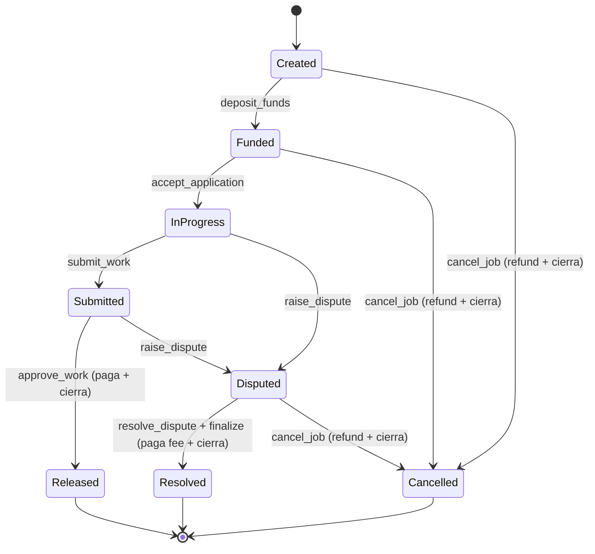
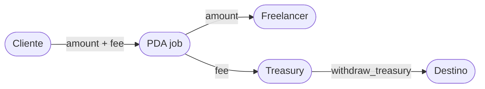
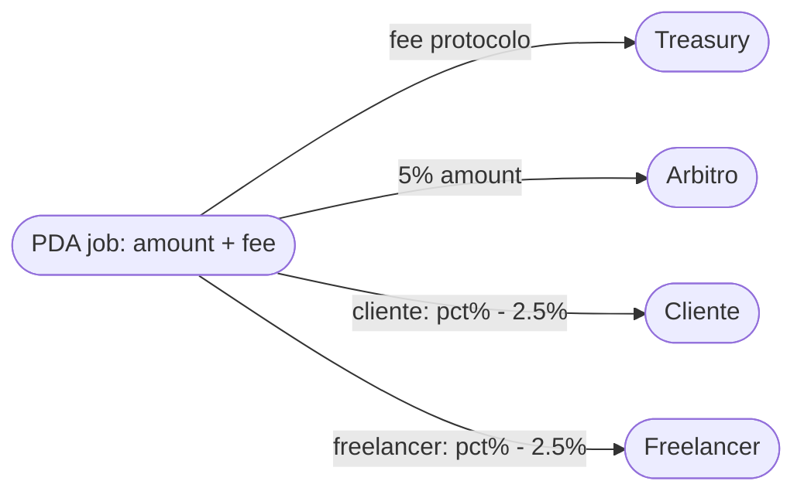

# 01 · Visión General y Decisiones de Diseño

`trust-escrow-v3` es una reescritura pulida de `trust-escrow` (v1) y
`trust-escrow-v2` (v2). Se portó función a función conservando lo correcto de
ambas versiones y corrigiendo los bugs encontrados en la auditoría.

## Decisiones de diseño (y correcciones de auditoría)

### 1. Fee en basis points (`fee_bps`, 0–10000)
- **v2** dividía `amount * fee_percent / 10000` pero validaba `fee_percent <= 100`,
  cobrando ~100× menos de lo indicado.
- **v3** usa `fee_bps` (10000 = 100%) con validación `fee_bps <= BASIS_POINTS` y
  un helper `compute_fee()` con aritmética chequeada (`checked_mul`).

### 2. Enrutado correcto de las fees
- **v2** transfería la fee al PDA `config` (inaccesible) en vez de a `treasury`.
- **v3** las fees siempre van a la wallet `treasury` (validada contra
  `config.treasury`) y `withdraw_treasury` la saca desde ahí.

### 3. Pagos desde PDA con `new_with_signer`
- **v2** usaba `CpiContext::new` para transferir **desde** el PDA `job` sin firmar
  con sus seeds → la transferencia del system program fallaba en runtime
  ("missing required signature"). Afectaba `approve_work`, `cancel_job`,
  milestones y disputas.
- **v3** todo pago desde un PDA usa `CpiContext::new_with_signer` con los seeds
  del PDA + bump.

### 4. Cierre de PDAs para no atrapar fondos
- **v2** en disputas nunca cobraba la fee ni cerraba `job`/`dispute` → fondos y
  renta atrapados para siempre.
- **v3** las instrucciones de liberación/cierre cobran la fee a `treasury` y
  hacen `close = <beneficiario>` para devolver la renta.

### 5. Control de Milestones vs fondos depositados
- **v3** lleva `milestones_amount_total` y contadores aprobados para garantizar
  que la suma de hitos nunca supere `job.amount`.

### 6. Arbiter designado por job (estilo v1)
- El modelo de pool de árbitros de v2 era complejo y propenso a errores. v3 usa
  un árbitro designado por el cliente al crear el job (probado y correcto en v1),
  con un `ArbiterPool` opcional documentado aparte.

## Modelo de fee

### Fee de protocolo (siempre)
- El cliente deposita `amount + fee` en el PDA `job`, donde `fee = compute_fee(amount, fee_bps)`.
- Al aprobar (sin disputa): el PDA `job` paga `amount` al freelancer y `fee` a `treasury`.
- Conservación: entrada = salida = `amount + fee`.

### Fee de arbitraje (SOLO si se abrió una disputa)
- **Regla de oro:** si una disputa se **abrió** (por cualquiera de las partes), se
   cobra **sí o sí**. Ambas partes pagan su 2.5% (5% de **lo disputado**:
   `job.amount` menos milestones ya pagados) "les guste o
  no". No se asigna árbitro en la creación del job (evita "trabajos fantasma" y
  cobrar por servicio no usado → riesgo legal).
- **Al abrir la disputa, cada parte firma y postea su bono de 2.5%** a un PDA
  `ArbitrationEscrow`. Esto garantiza que, aunque a una parte se le adjudique 0%,
  ya pagó su 2.5% (el perdedor no se escapa).
- **El 5% se paga al resolutor:**
  - Arbitraje mutuo (ambos firmaron `accept_dispute`) → árbitro neutral asignado
    por la plataforma recibe el 5%.
  - Uno solo abrió / árbitro falló → el **asesor de plataforma** resuelve y recibe
    el 5% (actúa como resolutor; no es "gratis" porque la disputa sí se abrió).
- **Sin disputa abierta** (aprobación normal, o auto-aprueba por `SUBMITTED_GRACE`):
  $0$ de arbitraje; el asesor es gratis solo en esa administración.
- Conservación (con disputa): `resolutor(5%) + cliente + freelancer + treasury(fee) = amount + fee`.

## Flujo de estados del Job

## Flujo de fondos (fee)

### Flujo de fondos en disputa (fee de arbitraje)

