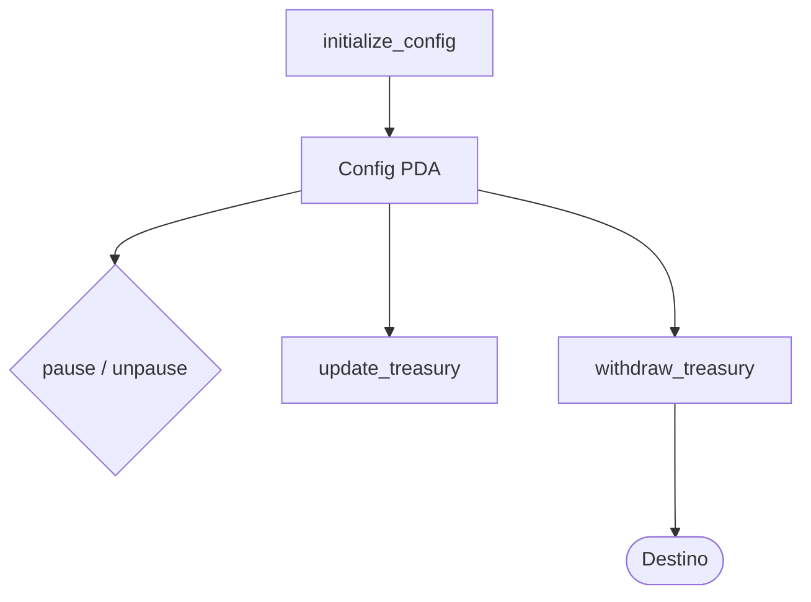

# 04 · Módulo Config

Gestión global del contrato: inicialización, pausa, tesorería y retiro de fees.
Es el primer módulo portado y ya está implementado en `lib.rs`.

## `initialize_config`

**Qué hace**
Crea la cuenta PDA `Config` (seed `[b"config"]`) con:
- `authority` = firmante.
- `treasury` = wallet pasada como argumento (recibe las fees).
- `fee_bps` = fee en basis points (validado 0–10000).
- `paused = false`.

**Por qué**
Reemplaza a `initialize_config` de v1 (que hardcodeaba `FEE_PERCENT = 5`).
En v3 la fee es configurable y se expresa en basis points, corrigiendo el bug
de v2 donde la validación (0–100) no coincidía con el cálculo (`/10000`).

**Validaciones**
- `fee_bps <= BASIS_POINTS` → `InvalidFeeBps`.

**Cuentas**: `authority` (Signer, paga), `treasury` (UncheckedAccount), `config` (init PDA), `system_program`.

## `pause` / `unpause`

**Qué hace**
Ponen `config.paused = true/false`. Las instrucciones de job comprueban
`ProgramPaused`.

**Por qué**
Kill-switch de emergencia. En v1 eran dos instrucciones separadas; se mantienen
igual porque funcionaban correctamente.

**Validaciones**
- `config.authority == firmante` → `NotAuthorized`.

## `update_treasury`

**Qué hace**
Cambia `config.treasury` a `new_treasury`.

**Por qué**
Permite rotar la wallet de tesorería sin redeploy. (En v2 existía y funcionaba;
se conserva.)

**Validaciones**
- `config.authority == firmante` → `NotAuthorized`.

## `withdraw_treasury`

**Qué hace**
Transfiere `amount` lamports desde la wallet `treasury` hacia `destination` vía
CPI al system program.

**Corrección de auditoría (v2)**
- **v2**: `treasury` era `SystemAccount` (no firmaba) → el CPI fallaba siempre;
  además no validaba `treasury == config.treasury`, y las fees en realidad se
  depositaban en el PDA `config`, no en `treasury`.
- **v3**: `treasury` es `Signer` y tiene
  `constraint = treasury.key() == config.treasury`. Las fees del protocolo se
  cobran a `treasury` (ver módulo Jobs), así que este retiro opera sobre los
  fondos correctos.

**Validaciones**
- `amount > 0` → `AmountTooSmall`.
- `treasury.get_lamports() >= amount` → `InsufficientFunds`.
- `treasury.key() == config.treasury` → `NotAuthorized`.

**Cuentas**: `treasury` (Signer + constraint), `destination` (UncheckedAccount), `config`, `system_program`.

## Diagrama del módulo

