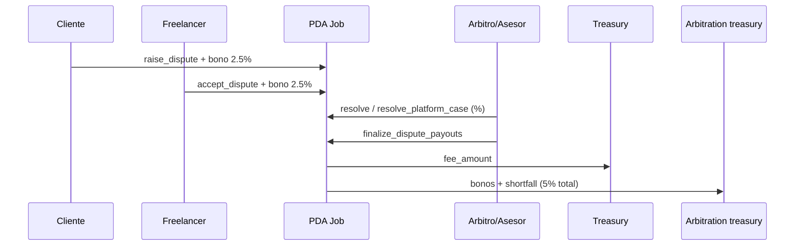

# 06 · Módulo Disputes

Estado: ✅ implementado completo.

Modelo: el árbitro es neutral y lo asigna la plataforma solo al abrirse la
disputa. Si se abrió una disputa, **se cobra sí o sí**: ambas partes firman y
postean un bono de 2.5% (`ArbitrationEscrow`); el 5% total va a la **cuenta de
arbitraje de la empresa** (`config.arbitration_treasury`), **NUNCA al wallet
personal del asesor/árbitro** (contabilidad separada). En arbitraje mutuo el
resolutor es un árbitro neutral asignado por la plataforma; en caso de oficio
(una parte no acepta / el árbitro falla) resuelve el asesor de plataforma. Sin
disputa abierta → $0$ de arbitraje.

El árbitro o asesor solo firma/autoriza; ningún resolutor recibe la fee en su
wallet personal. Una compensación off-chain, si se adopta, es futura y no forma
parte del payout contractual.

## `raise_dispute`
- Quien abre (`raiser`, cliente o freelancer) firma y postea su bono 2.5% al
  `ArbitrationEscrow` (nuevo PDA, seed `[b"arb_fee", job]`).
- Crea `Dispute` (seed `[b"dispute", job]`) en estado `Open`. Job → `Disputed`.
- `reason` no vacío → `EmptyDisputeReason`. Job en `Submitted`/`InProgress` →
  `CannotDisputeAtStage`. `raiser` debe ser cliente o freelancer → `NotAuthorized`.

## `accept_dispute`
- La contraparte (`accepter`) firma y postea su bono 2.5%. Dispute → `Active`.
- `accepter != raised_by` y debe ser la otra parte → `NotAuthorized`.
- Estado debe ser `Open` → `DisputeAlreadyResolved`.

## `submit_evidence`
- Cliente o freelancer adjunta una cuenta PDA `Evidence` individual (seed
  `[b"evidence", dispute, index]`, <= `MAX_DISPUTE_EVIDENCE`). `Dispute` solo
  conserva el contador; no contiene una colección inline de evidencias.
- Estado no puede ser `Resolved`/`Expired`. Pasa a `EvidenceSubmitted`.

## `assign_arbiter` (plataforma = `config.authority`)
- Toma un árbitro del `ArbiterPool` y lo fija en `dispute.arbiter`.
- `dispute.arbiter` debe ser `None` → `NotValidArbiter`. Dispute en `Active`/
  `EvidenceSubmitted`. Árbitro debe estar en el pool → `NotValidArbiter`.
- **El árbitro no puede ser `job.client` ni `job.freelancer`** → `ArbiterCannotBeParty`
  (neutralidad). Ver `09-auditoria.md`.

## `resolve_dispute` (árbitro asignado)
- `dispute.arbiter == firmante` → `NotArbiter`. Estado `ArbiterAssigned`.
- Fija `client_payout_percent` (y `100 - ese` para freelancer). `>100` →
  `InvalidPercent`. Dispute → `Resolved`.

## `request_platform_intervention` (cualquiera de las partes)
- Si la contraparte no aceptó (`Open`), habilita el caso de plataforma
  (Dispute → `EvidenceSubmitted`) para que el asesor resuelva.

## `resolve_platform_case` (asesor = `config.advisor`)
- `config.advisor == firmante` → `NotAuthorized`. El asesor **no puede ser**
  `job.client` ni `job.freelancer` → `ArbiterCannotBeParty`.
- Permite resolver cuando `dispute.arbiter` es `None` O cuando el árbitro fue
  asignado pero no resolvió (`status == ArbiterAssigned`) → fallback de plataforma.
- Fija los `%` y resuelve. La fee de arbitraje (5%) **va a `arbitration_treasury`**
  (cuenta de la empresa), no al wallet del asesor.

## `finalize_dispute_payouts` (resolutor: árbitro o asesor)
El PDA `job` firma (`new_with_signer`):
- `treasury` ← `fee_amount` (comisión de plataforma).
- `client` ← su `%` de `amount`, con el bono faltante descontado de su reparto
  cuando corresponda.
- `freelancer` ← su `%` de `amount`, con el bono faltante descontado de su
  reparto cuando corresponda.
- `ArbitrationEscrow` se cierra (`close = arbitration_treasury`) → envía el 5% de
  bonos a la **cuenta de arbitraje de la empresa**.
- El faltante entre el 5% exigido y los bonos ya posteados se transfiere desde
  `job` a `arbitration_treasury`; el resolutor nunca es destino de lamports.
- `job` y `dispute` se cierran (`close = client`, renta devuelta).

**Conservación:** `treasury(fee) + arbitration_treasury(5% de lo disputado) + cliente + freelancer = amount + fee`
(donde `amount` es lo disputado = `job.amount` − milestones ya pagados; la fee de arbitraje va a la
posteado vía `close` del escrow + el `shortfall` recuperado del PDA job).

## Diagrama

## `SupportTicket` (cancelación por incumplimiento, sin bono)

Cuando el freelancer no entrega / no cumple en `InProgress`/`Submitted`, el cliente
(o freelancer) **no paga bono** de disputa: abre un ticket al asesor de plataforma.

- `open_support_ticket`: cualquiera de las partes abre el ticket (seed
  `[b"support", job]`, sin bono). Solo en `InProgress`/`Submitted`.
- `resolve_support_ticket` (`config.advisor`, y que no sea parte): cancela el job
  (`Cancelled`) y el PDA `job` cierra hacia `client` (`close = client`) → devuelve
  **solo lo no devengado**. El freelancer se queda lo ya cobrado en milestones
  aprobados. El ticket cierra hacia `opener`.

**Exclusión mutua:** no puede haber abierta una `Dispute` y un `SupportTicket` al
mismo tiempo (`open_support_ticket` exige que no exista `Dispute`; `raise_dispute`
exige que no exista `SupportTicket`). Así se evita que, al resolverse uno, quede el
`ArbitrationEscrow` de la otra huérfano.

## Referencias
- `[../contract/01-overview.md](../contract/01-overview.md)` (modelo de fee)
- `[../scenarios/03-disputa-arbitraje-mutuo.md](../scenarios/03-disputa-arbitraje-mutuo.md)`
- `[../scenarios/04-disputa-asesor.md](../scenarios/04-disputa-asesor.md)`
