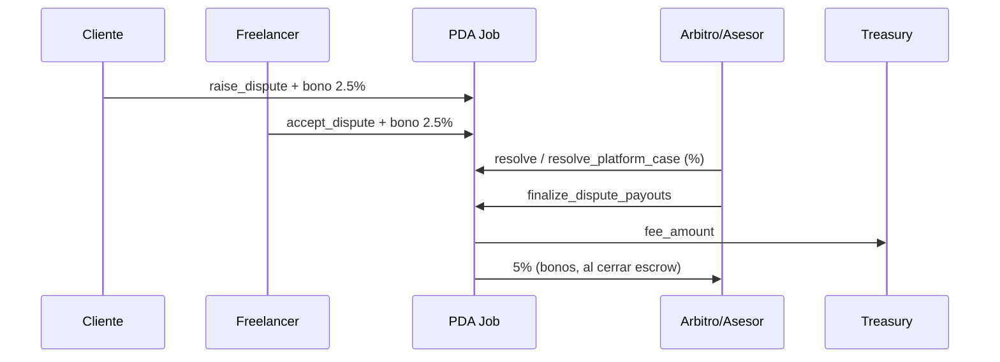

# 06 · Módulo Disputes

Estado: ✅ implementado completo.

Modelo: el árbitro es neutral y lo asigna la plataforma solo al abrirse la
disputa. Si se abrió una disputa, **se cobra sí o sí**: ambas partes firman y
postean un bono de 2.5% (`ArbitrationEscrow`); el 5% total va al **resolutor**
(árbitro en arbitraje mutuo, o asesor de plataforma si una parte no acepta /
el árbitro falla). Sin disputa abierta → $0$ de arbitraje.

## `raise_dispute`
- Quien abre (`raiser`, cliente o freelancer) firma y postea su bono 2.5% al
  `ArbitrationEscrow` (nuevo PDA, seed `[b"arb_fee", job]`).
- Crea `Dispute` (seed `[b"dispute", job]`) en estado `Open`. Job → `Disputed`.
- `reason` no vacío → `EmptyDisputeReason`. Job en `Submitted`/`InProgress` →
  `CannotDisputeAtStage`. `raiser` debe ser cliente o freelancer → `NotAuthorized`.

## `accept_dispute`
- La contraparte (`accepter`) firma y postea su bono 2.5%. Dispute → `Active`.
- `accepter != raised_by` y debe ser la otra parte → `NotAuthorized`.
- Estado debe ser `Open` → `DisputeAlreadyResolved`.

## `submit_evidence`
- Cliente o freelancer adjunta `Evidence` (<= `MAX_DISPUTE_EVIDENCE`).
- Estado no puede ser `Resolved`/`Expired`. Pasa a `EvidenceSubmitted`.

## `assign_arbiter` (plataforma = `config.authority`)
- Toma un árbitro del `ArbiterPool` y lo fija en `dispute.arbiter`.
- `dispute.arbiter` debe ser `None` → `NotValidArbiter`. Dispute en `Active`/
  `EvidenceSubmitted`. Árbitro debe estar en el pool → `NotValidArbiter`.
- **El árbitro no puede ser `job.client` ni `job.freelancer`** → `ArbiterCannotBeParty`
  (neutralidad). Ver `09-auditoria.md`.

## `resolve_dispute` (árbitro asignado)
- `dispute.arbiter == firmante` → `NotArbiter`. Estado `ArbiterAssigned`.
- Fija `client_payout_percent` (y `100 - ese` para freelancer). `>100` →
  `InvalidPercent`. Dispute → `Resolved`.

## `request_platform_intervention` (cualquiera de las partes)
- Si la contraparte no aceptó (`Open`), habilita el caso de plataforma
  (Dispute → `EvidenceSubmitted`) para que el asesor resuelva.

## `resolve_platform_case` (asesor = `config.advisor`)
- `config.advisor == firmante` → `NotAuthorized`. El asesor **no puede ser**
  `job.client` ni `job.freelancer` → `ArbiterCannotBeParty`.
- Permite resolver cuando `dispute.arbiter` es `None` O cuando el árbitro fue
  asignado pero no resolvió (`status == ArbiterAssigned`) → fallback de plataforma.
- Fija los `%` y resuelve. El asesor **cobra el 5%** de los bonos (es el resolutor).

## `finalize_dispute_payouts` (resolutor: árbitro o asesor)
El PDA `job` firma (`new_with_signer`):
- `treasury` ← `fee_amount` (comisión de plataforma).
- `client` ← `%` de `amount` **menos su bono si no lo posteó** (`saturating_sub`).
- `freelancer` ← `%` de `amount` **menos su bono si no lo posteó**.
- `ArbitrationEscrow` se cierra (`close = resolver`) → envía el 5% de bonos al
  resolutor.
- `job` y `dispute` se cierran (`close = client`, renta devuelta).

**Conservación:** `treasury(fee) + resolver(5%) + cliente + freelancer = amount + fee`.

## Diagrama

## Referencias
- `[../contract/01-overview.md](../contract/01-overview.md)` (modelo de fee)
- `[../scenarios/03-disputa-arbitraje-mutuo.md](../scenarios/03-disputa-arbitraje-mutuo.md)`
- `[../scenarios/04-disputa-asesor.md](../scenarios/04-disputa-asesor.md)`
