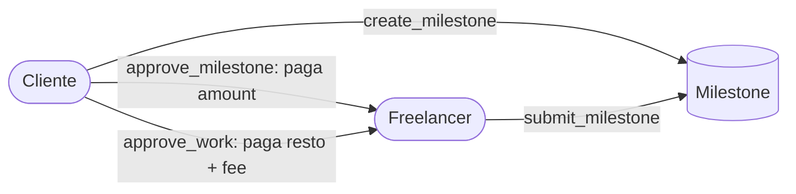

# 07 · Módulo Milestones

Estado: ✅ implementado.

Los milestones son un **cronograma de pagos** opcional del `job.amount`. Cada
milestone aprobado paga su `amount` desde el PDA `job` al freelancer. El release
final (job o disputa) paga solo el **resto** (`amount - milestones_amount_total`),
evitando pagos duplicados o fondos atrapados.

## `create_milestone`
- Cliente crea el milestone (seed `[b"milestone", job, index]`) en estado `Pending`.
- Job debe estar `InProgress`.
- **Valida** `milestones_amount_total + amount <= job.amount` →
  `MilestoneAmountExceedsFunds` (corrige el bug de v2 sin control de suma).
- `deadline` futuro, títulos dentro de límites, `milestones_total < MAX_MILESTONES`.
- Incrementa `job.milestones_total` y `job.milestones_amount_total`.

## `submit_milestone`
- Freelancer (`job.freelancer`) marca el milestone como `Submitted`.
- **Sin bloqueo por deadline** (corrige el bug de v2 que impedía enviar tras la
  deadline).

## `approve_milestone`
- Cliente aprueba. El PDA `job` firma (`new_with_signer`) y paga `milestone.amount`
  al freelancer. Milestone → `Approved`, `job.milestones_approved += 1`.
- **Exige** `job.status == InProgress` (no pagar durante una disputa) y
  `freelancer.key() == job.freelancer` (evita desviar el pago). Ver `09-auditoria.md`.

## `reject_milestone`
- Cliente rechaza → milestone `Rejected`.

## Integración con el release final
- `approve_work` (job) paga el **resto** y exige que, si hay milestones, estén
  todos aprobados (`AllMilestonesRequired`).
- `finalize_dispute_payouts` reparte el **resto** (lo no pagado por milestones).

## Conservación
`Σ milestone.amount + resto + fee = amount + fee`. Sin duplicados ni fondos atrapados.

## Diagrama

