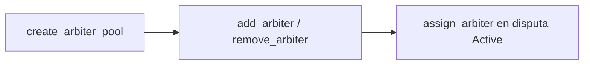

# 08 · Arbiter Pool

Estado: ✅ implementado en el contrato; la compensación off-chain del árbitro no
forma parte del contrato.

El pool es el registro de árbitros neutrales de los que la plataforma elige al
asignar una disputa (`assign_arbiter`). El árbitro es **neutral** y se asigna solo
cuando se abre una disputa (nunca en la creación del job).

## `create_arbiter_pool`
- Crea `ArbiterPool` (seed `[b"arbiter_pool"]`). `authority` = firmante.

## `add_arbiter`
- `authority` firma. Agrega un árbitro al `pool.arbiters` (<= `MAX_ARBITERS`).
- No duplicados → `NotValidArbiter`.

## `remove_arbiter`
- `authority` firma. Quita un árbitro del pool (debe existir → `NotValidArbiter`).

## `assign_arbiter` (ver `06-disputes.md`)
- `config.authority` asigna un árbitro del pool a la disputa `Active`.

## Notas de diseño
- `config.advisor` (separado de `authority`) es quien resuelve los `PlatformCase`
  cuando no hay arbitraje mutuo.
- El árbitro/asesor solo autoriza la resolución; el 5% de los bonos se enruta a
  `Config.arbitration_treasury` vía `finalize_dispute_payouts`, nunca a su wallet.
- Cualquier pago off-chain al árbitro es una política operativa futura y no una
  capacidad on-chain implementada.

## Diagrama

