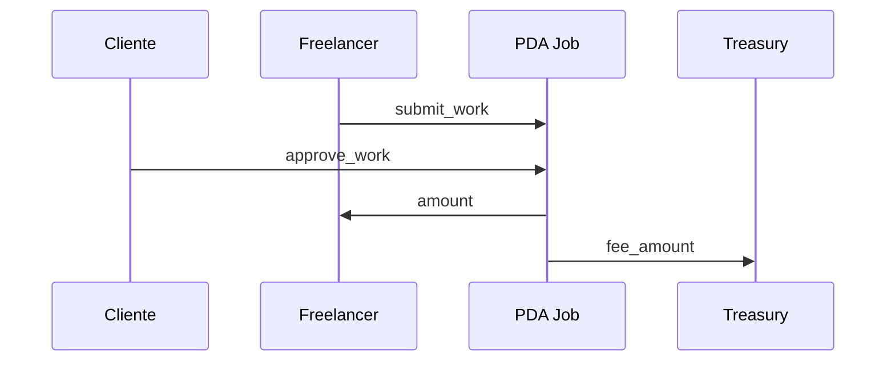

# Escenario 2 · Entrega y aprobación (sin disputa)

**Integrantes:** Cliente · Freelancer · Programa (`Job`) · Treasury

## Precondiciones
- Job en `Funded` (Escenario 1 completo).
- Freelancer aceptado y trabajo entregado (`submit_work` → `Submitted`).

## Flujo
1. **Freelancer** → `submit_work(job_id)` → job `Submitted`.
2. **Cliente** → `approve_work(job_id)`
   - El PDA `Job` firma con `new_with_signer` y:
     - paga `amount` al `freelancer`,
     - paga `fee_amount` a `treasury`,
   - Job se cierra (`close = client`, renta devuelta).

## Postcondiciones
- Freelancer recibió `amount`.
- `treasury` recibió la comisión de plataforma (`fee_amount`).
- **Sin disputa** → $0$ de arbitraje.

## Resumen de fees
- Plataforma: `fee_amount` (a treasury). Arbitraje: $0$.

## Referencias
- `[../contract/05-jobs.md](../contract/05-jobs.md)` (pendiente `approve_work`)
