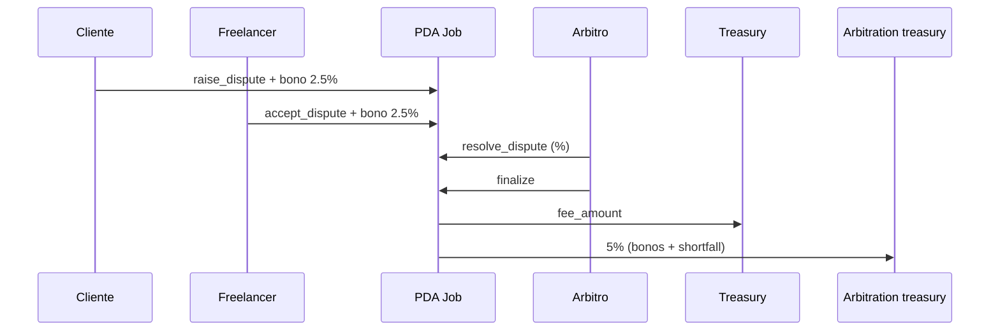

# Escenario 3 · Disputa con arbitraje mutuo

**Integrantes:** Cliente · Freelancer · Programa (`Job`, `Dispute`, `ArbitrationEscrow`) ·
Árbitro (del `ArbiterPool`) · Autoridad (asigna) · Treasury

## Precondiciones
- Job en `Submitted` o `InProgress`.
- Ambas partes están dispuestas a aceptar la disputa (arbitraje mutuo).

## Flujo
1. **Cliente** → `raise_dispute(job_id, reason)`
   - Crea `Dispute` + `ArbitrationEscrow`.
   - Cliente postea su bono 2.5% (al `ArbitrationEscrow`). Job → `Disputed`.
2. **Freelancer** → `accept_dispute(job_id)`
   - Freelancer postea su bono 2.5%. Dispute → `Active`.
3. **Autoridad** → `assign_arbiter(job_id)` → asigna árbitro del pool.
4. **Cliente/Freelancer** → `submit_evidence` (opcional).
5. **Árbitro** → `resolve_dispute(job_id, client_pct, freelancer_pct)`
   - Fija el reparto (suman 100). Dispute → `Resolved`.
6. **Árbitro** → `finalize_dispute_payouts(job_id)` (PDA `Job` firma)
   - `treasury` ← `fee_amount` (comisión plataforma).
    - `ArbitrationEscrow` cierra → `arbitration_treasury` recibe 5% (bonos).
   - cliente/freelancer reciben su `%` de `amount`.
   - `Job` y `Dispute` cierran (renta devuelta).

## Postcondiciones
- Ambas partes pagaron su 2.5% (bonos). `arbitration_treasury` recibió 5%.
- Reparto según el `%` fijado por el árbitro.

## Resumen de fees
- Plataforma: `fee_amount`. Arbitraje: 5% del `amount` a
  `arbitration_treasury` (2.5% cliente + 2.5% freelancer); el árbitro solo autoriza.

## Referencias
- `[../contract/06-disputes.md](../contract/06-disputes.md)`
- `[../contract/02-errores.md](../contract/02-errores.md)` (`EmptyDisputeReason`, `CannotDisputeAtStage`)
