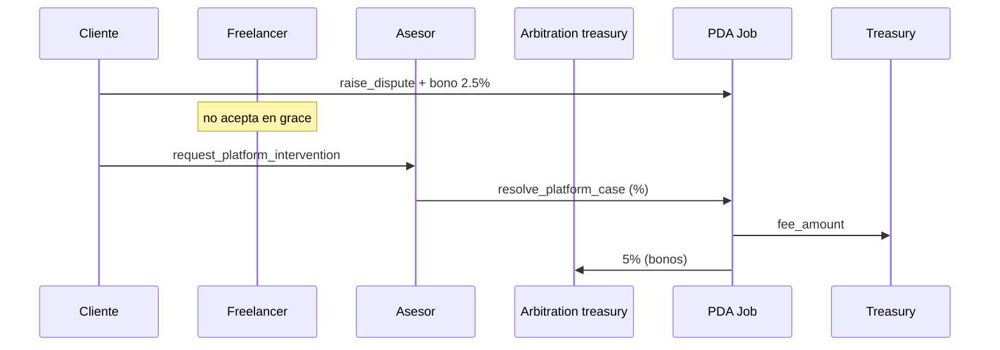

# Escenario 4 · Disputa resuelta por asesor (una parte no acepta)

**Integrantes:** Cliente · Freelancer · Programa (`Job`, `Dispute`, `ArbitrationEscrow`) ·
Asesor de plataforma (`config.advisor`) · Treasury

## Precondiciones
- Una parte abrió la disputa (`raise_dispute` + su bono), pero la otra **no**
  acepta dentro de `DISPUTE_ACCEPT_GRACE`.

## Flujo
1. **Cliente** → `raise_dispute(job_id)` + bono 2.5%. Job → `Disputed`.
2. **Freelancer** no firma `accept_dispute` dentro de la grace → queda en
   `PlatformCase`.
3. **Cualquiera** → `request_platform_intervention(job_id)` (abre caso de plataforma).
4. **Asesor** → `resolve_platform_case(job_id, client_pct, freelancer_pct)`
    - El asesor actúa como resolutor y solo autoriza; los bonos y el faltante se
      envían a `arbitration_treasury`.
   - Si falta el bono del freelancer, se descuenta de su partición (puede quedar
     en 0).
   - `treasury` recibe `fee_amount`; `Job` y `Dispute` cierran.

## Postcondiciones
- La disputa **se abrió** → se cobra sí o sí. El 5% va a `arbitration_treasury`.
- Quien no aceptó igual paga su 2.5% (vía bono posteado o descontado de su parte).

## Resumen de fees
- Plataforma: `fee_amount`. Arbitraje: 5% a `arbitration_treasury`; el asesor
  solo firma porque resolvió la disputa abierta.

## Referencias
- `[../contract/06-disputes.md](../contract/06-disputes.md)`
- `[../contract/01-overview.md](../contract/01-overview.md)` (modelo de fee)
