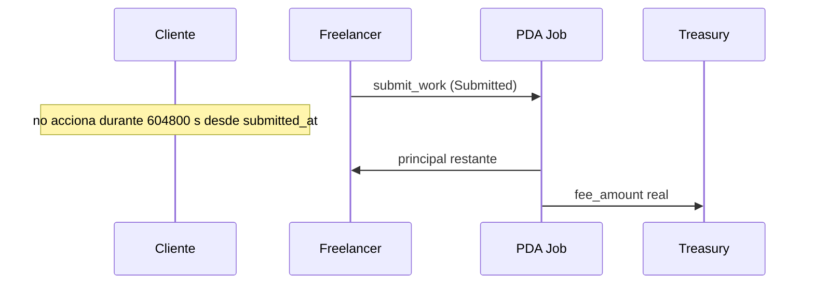

# Escenario 5 · Auto-aprobación por inactividad del cliente

**Integrantes:** Cliente · Freelancer · Programa (`Job`) · Treasury

## Precondiciones
- Job en `Submitted` (freelancer entregó).
- `submit_work` registra `submitted_at` en el `Job`; el freelancer no puede
  proporcionar libremente ese timestamp.
- El cliente **no** aprueba ni rechaza durante la ventana exacta de 7 días
  (`604800` segundos) desde `submitted_at`.
- No existe una `Dispute` PDA abierta: cualquier disputa bloquea la
  auto-aprobación y debe resolverse por el flujo de disputas.

## Flujo
1. Cuando `now >= submitted_at + 604800`, sin acción del cliente, un keeper
   cualquiera puede ejecutar `auto_approve_work` (regla determinista, sin
   intervención humana):
   - PDA `Job` firma (`new_with_signer`): paga solo el **principal restante**
     (`amount - milestones_amount_total`) al freelancer ligado al Job.
   - Paga el `fee_amount` real almacenado en el Job a `Config.treasury`;
     no calcula ni cobra una fee de arbitraje.
   - Job cierra (`close = client`).

## Postcondiciones
- Freelancer cobra el principal restante; `treasury` cobra el `fee_amount` real.
- **No se abrió disputa** → $0$ de arbitraje (el asesor no intervino, es
  automático y nadie puede alegar sesgo).

## Por qué deja al cliente sin queja posible
- Regla determinista y divulgada (ToS): la inactividad = aceptación.
- El cliente tuvo una ventana clara de exactamente 7 días desde `submitted_at`
  para revisar/rechazar.
- El freelancer sí entregó, así que los fondos están legítimamente ganados.

## Resumen de fees
- Plataforma: `fee_amount` real del Job. Arbitraje: $0$ (no hubo disputa).

## Referencias
- `[../contract/01-overview.md](../contract/01-overview.md)` (grace / auto-aprueba)
- `[../contract/05-jobs.md](../contract/05-jobs.md)`
