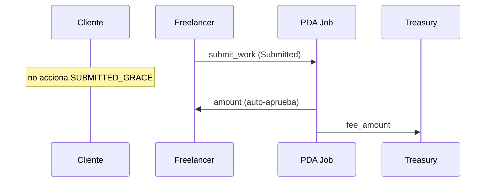

# Escenario 5 · Auto-aprobación por inactividad del cliente

**Integrantes:** Cliente · Freelancer · Programa (`Job`) · Treasury

## Precondiciones
- Job en `Submitted` (freelancer entregó).
- El cliente **no** aprueba ni rechaza dentro de `SUBMITTED_GRACE` tras la deadline.

## Flujo
1. Pasado `SUBMITTED_GRACE` sin acción del cliente, el programa **auto-aprueba**
   (regla determinista, sin intervención humana):
   - PDA `Job` firma (`new_with_signer`): paga `amount` al freelancer,
     `fee_amount` a `treasury`.
   - Job cierra (`close = client`).

## Postcondiciones
- Freelancer cobra `amount`; `treasury` cobra la comisión.
- **No se abrió disputa** → $0$ de arbitraje (el asesor no intervino, es
  automático y nadie puede alegar sesgo).

## Por qué deja al cliente sin queja posible
- Regla determinista y divulgada (ToS): la inactividad = aceptación.
- El cliente tuvo una ventana clara (`SUBMITTED_GRACE`) para revisar/rechazar.
- El freelancer sí entregó, así que los fondos están legítimamente ganados.

## Resumen de fees
- Plataforma: `fee_amount`. Arbitraje: $0$ (no hubo disputa).

## Referencias
- `[../contract/01-overview.md](../contract/01-overview.md)` (grace / auto-aprueba)
- `[../contract/05-jobs.md](../contract/05-jobs.md)`
