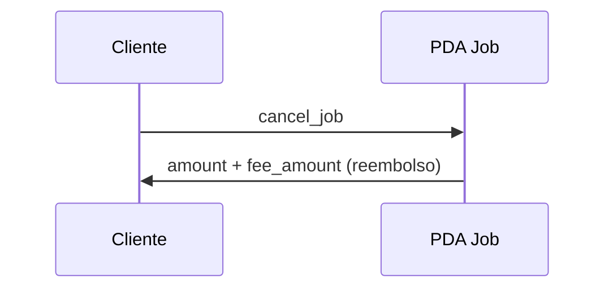

# Escenario 6 · Cancelación del job

**Integrantes:** Cliente · Programa (`Job`)

## Precondiciones
- Job en `Created` o `Funded` (antes de que inicie el trabajo).
- Quien cancela es `job.client`.

## Flujo
1. **Cliente** → `cancel_job(job_id)`
   - Si `Funded`: reembolsa `amount + fee_amount` al cliente desde el PDA `Job`.
   - Job → `Cancelled` y se cierra (`close = client`, renta devuelta).

## Postcondiciones
- Fondos devueltos al cliente (incluida la `fee_amount`).
- No se consumió el servicio → **no se paga comisión ni arbitraje**.

## Resumen de fees
- Plataforma: $0$. Arbitraje: $0$.

## Referencias
- `[../contract/05-jobs.md](../contract/05-jobs.md)` (pendiente `cancel_job`)
